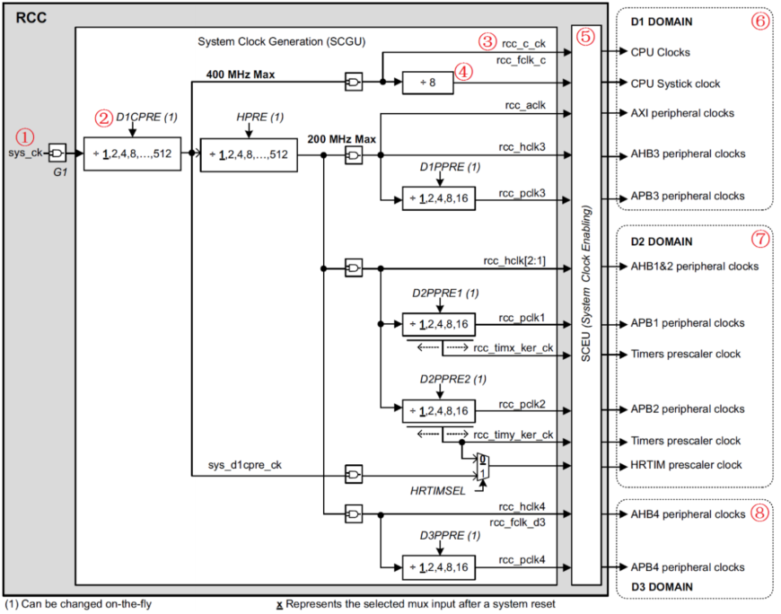
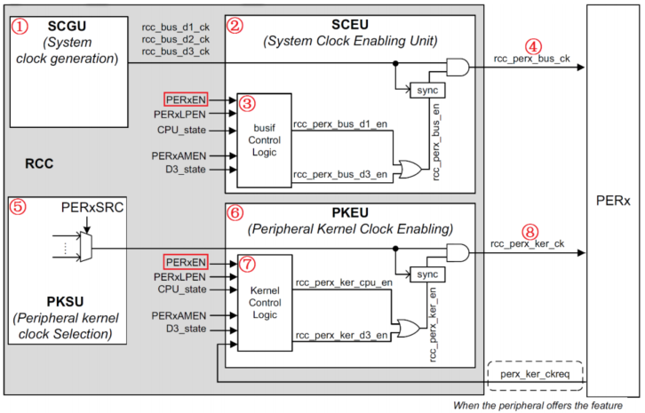
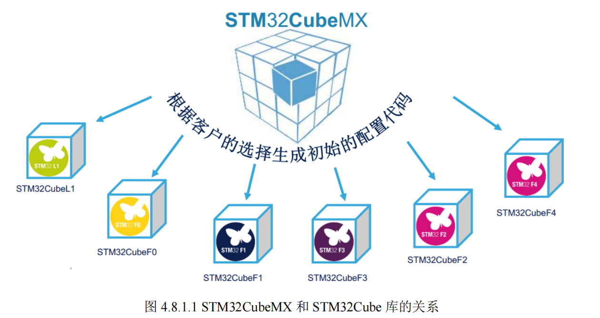

# CH04 STM32H7 基础知识入门
这一章，我们将着重 STM32 开发的一些基础知识，让大家对 STM32 开发有一个初步的了解，为后面 STM32 的学习做一个铺垫，方便后面的学习。这一章的内容大家第一次看的时候可以只了解一个大概，后面需要用到这方面的知识的时候再回过头来仔细看看。这章我们分8个小结，
- 4.1 MDK 下 C 语言基础复习
- 4.2 STM32H7 系统架构
- 4.3 STM32H743 时钟系统
- 4.4 IO 引脚复用器和映射
- 4.5 STM32H7 NVIC 中断优先级管理
- 4.6 MDK 中寄存器地址名称映射分析
- 4.7 MDK 固件库快速开发技巧
- 4.8 手把手教你入门 STM32CubeMX 图形配置工具

## 4.1 MDK 下 C 语言基础复习 🎯

### 4.1.1 C位操作

C语言支持以下六种位操作运算符。

| 运算符 | 含义 | 运算符 | 含义 |
| --- | --- | --- | --- |
| & | 按位与 | ~ | 按位取反 |
| \| | 按位或 | << | 左移 |
| ^ | 按位异或 | >> | 右移 |

### 4.1.2 宏定义

格式：`#define 标识符 字符串`， “标识符”为所定义的宏名。“字符串”可以是常数、表达式、格式串等。

### 4.1.3# ifdef 和 #if defined 条件编译

常见格式
```c
#ifdef 标识符
程序段 1 
#else 
程序段 2 
#endif
```

它的作用是：当标识符已经被定义过(一般是用#define 命令定义)，则对程序段 1 进行编
译，否则编译程序段 2。 其中#else 部分也可以没有，即：

```c
#ifdef 标识符
程序段
#endif
```
### 4.1.4 extern 变量申明
C 语言中 extern 可以置于变量或者函数前，以表示变量或者函数的定义在别的文件中，提示编译器遇到此变量和函数时在其他模块中寻找其定义。**这里面要注意，对于 extern 申明变量可以多次，但定义只有一次。**

### 4.1.5 typedef 类型别名
typedef 用于为现有类型创建一个新的名字，或称为类型别名，用来简化变量的定义。typedef 在 MDK 用得最多的就是定义结构体的类型别名和枚举类型了。

例如
```c
struct _GPIO
{
 __IO uint32_t MODER;
 __IO uint32_t OTYPER;
 …
};
```
以上代码定义了一个结构体_GPIO，这样我们定义变量的方式就是
```c
struct _GPIO GPIOA;//定义结构体变量 GPIOA
```
但是这样很繁琐，MDK 中有很多这样的结构体变量需要定义。这里我们可以为结体定义一个别名 GPIO_TypeDef，这样我们就可以在其他地方通过别名 GPIO_TypeDef 来定义结构体变量
了。方法如下：

```c
typedef struct
{
 __IO uint32_t MODER;
 __IO uint32_t OTYPER;
…
} GPIO_TypeDef;
```
Typedef 为结构体定义一个别名 GPIO_TypeDef，这样我们可以通过 GPIO_TypeDef 来定义结构体变量：
```c
GPIO_TypeDef _GPIOA,_GPIOB;
```
这里的 GPIO_TypeDef 就跟 struct _GPIO 是等同的作用了。 这样是不是方便很多？

### 4.1.6 结构体

声明结构体类型：
```c
Struct 结构体名{
成员列表;
}变量名列表；
```
例如
```c
Struct G_TYPE {
uint32_t Pin;
uint32_t Mode;
uint32_t Speed;
}GPIOA，GPIOB;
```
在结构体申明的时候可以定义变量，也可以申明之后定义，方法是：
```c
Struct 结构体名字 结构体变量列表 ;
```
例如
```c
struct G_TYPE GPIOA,GPIOB;
```
结构体成员变量的引用方法是：
```c
结构体变量名.成员名
```
结构体指针变量定义也是一样的，跟其他变量没有啥区别。例如
```c
struct G_TYPE *GPIOC；//定义结构体指针变量 GPIOC;
```
结构体指针成员变量引用方法是通过“->”符号实现，比如要访问 GPIOC 结构体指针指向的结构体的成员变量 Speed,方法是：
```c
GPIOC->Speed
```
!!! note
    **结构体的好处：**
    任何时候，我们只需要修改结构体成员变量，往结构体中间加入新的成员变量，而不需要修改函数定义就可以达到修改入口参数同样的目的了。这样的好处是不用修改任何函数定义就可以达到增加变量的目的。

!!! tip
    理解了结构体在这个例子中间的作用吗？在以后的开发过程中，如果你的变量定义过多，如果某几个变量是用来描述某一个对象，你可以考虑将这些变量定义在结构体中，这样也许可以提高你的代码的可读性。

## 4.2 STM32H7 系统架构 🎯
~


## 4.3 STM32H743 时钟系统 🎯
### 4.3.1 STM32H7 时钟树概述




大部分外设的使用，需要同时用到外设总线时钟（rcc_perx_bus_ck）和外设内核时钟（rcc_perx_ker_ck），一般情况下，这两个时钟都是由 PERxEN 控制使能。

### 4.3.2 STM32H7 时钟系统配置

### 4.3.3 STM32H7 时钟使能和配置

## 4.4 IO 引脚复用器和映射
~
## 4.5 STM32H7 NVIC 中断优先级管理
CM7 内核支持 256 个中断，其中包含了 16 个内核中断和 240 个外部中断，并且具有 256级的可编程中断设置。但 STM32H743 并没有使用 CM7 内核的全部东西，而是只用了它的一部分。STM32H743xx 总共有 118 个中断，以下仅以 STM32H743xx 为例讲解。

## 4.6 MDK 中寄存器地址名称映射分析
~
## 4.7 MDK 固件库快速开发技巧

## 4.8 手把手教你入门 STM32CubeMX 图形配置工具 🎯
上一章我们讲解 stm32Cube 的时候提到 stm32Cube 包含 2 个部分：一部分是上一章我们讲解的嵌入式软件包（包括 HAL 库），另一部分是图形化配置工具 STM32CubeMX。本小节我们将给大家讲解 STM32CubeMX 相关知识，带领大家入门 STM32CubeMX 图形化配置工具。之所以我们要把 STM32CubeMX 讲解放在本小节，是因为 STM32CubeMX 最基本也是最重要的用途是配置时钟系统，所以我们要先讲解 STM32H7 的时钟系统之后，才能教大家学习STM32CubeMX。这部分内容我们分 3 个小节来讲解：
- 4.8.1 STM32CubeMX 简介
- 4.8.2 STM32CubeMX 运行环境搭建
- 4.8.3 使用 STM32CubeMX 工具配置工程模板

### 4.8.1 STM32CubeMX 简介
STM32CubeMX 是 ST 意法半导体近几年来大力推荐的 STM32 芯片图形化配置工具，允许用户使用图形化向导生成 C 初始化代码，可以大大减轻开发工作，时间和费用。STM32CubeMX几乎覆盖了 STM32 全系列芯片。它具有如下特性：
① 直观的选择 MCU 型号，可指定系列、封装、外设数量等条件
② 微控制器图形化配置
③ 自动处理引脚冲突
④ 动态设置时钟树，生成系统时钟配置代码
⑤ 可以动态设置外围和中间件模式和初始化
⑥ 功耗预测
⑦ C 代码工程生成器覆盖了 STM32 微控制器初始化编译软件，如 IAR，KEIL，GCC。 
⑧ 可以独立使用或者作为 Eclipse 插件使用
对于 STM32CubeMX 和 STM32Cube 的关系这里我们还需要特别说明一下，STM32Cube包含 STM32CubeMX 图形工具和 STM32Cube 库两个部分，使用 STM32CubeMX 配置生成的代码，是基于 STM32Cube 库的。也就是说，我们使用 STM32CubeMX 配置出来的初始化代码，和 STM32Cube 库兼容，例如硬件抽象层代码就是使用的 STM32 的 HAL 库。不同的 STM32 系列芯片，会有不同的 STM32Cube 库支持，而 STM32CubeMX 图形工具只有一种。所以我们配置不同的 STM32 系列芯片，选择不同的 STM32Cube 库即可。它们之间的关系如下图：



### 4.8.2 STM32CubeMX 运行环境搭建
- Java
- STM32CubeMX

### 4.8.3 使用 STM32CubeMX 工具配置工程模板
大多数情况下，我们都只使用 STM32CubeMX 来生成工程的时钟系统初始化代码以及外设的初始化代码，因为用户控制逻辑代码是无法在 STM32CubeMX 中完成的，需要用户自己根据需求来实现。使用 STM32CubeMX 配置工程的一般步骤为：
1）工程初步建立和保存
2）RCC 设置
3）时钟系统（时钟树）配置
4）GPIO 功能引脚配置
5）生成工程源码
6）用户代码
接下来我们将按照上面 6 个步骤，依次教大家使用 STM32CubeMX 工具生成一个完整的工程模板。

#### 4.8.3.1 工程初步建立和保存
File>New Project，选择对应的芯片型号，然后选择对应的工程路径，点击 OK，然后保存工程。

#### 4.8.3.2 RCC 设置

#### 4.8.3.3 时钟系统（时钟树）配置

#### 4.8.3.4 GPIO 功能引脚配置

#### 4.8.3.5 Cortex-M7 内核基本配置

#### 4.8.3.6 生成工程源码

#### 4.8.3.7 编写用户程序
这里大家需要注意，STM32CubeMX 生成的main.c 文件中，有很多地方有“/* USER CODE BEGIN X */”和“/* USER CODE END X */”格式的注释，我们在这些注释的 BEGIN 和 END 之间编写代码，那么重新生成工程之后，这些代码会保留而不会被覆盖。