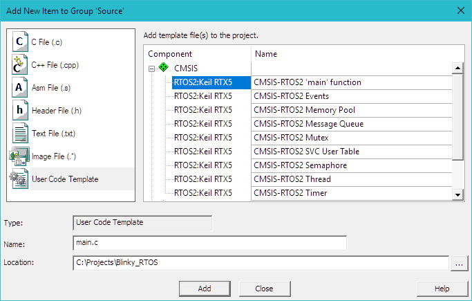
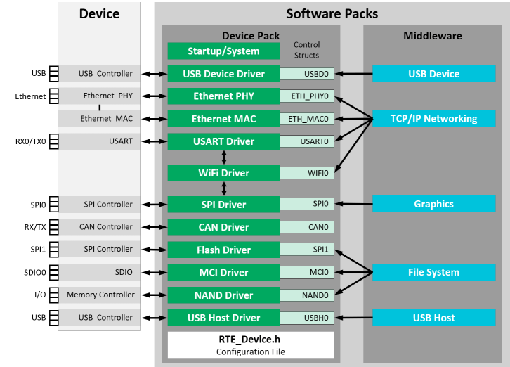

# Cortex Microcontroller Software Interface Standard (CMSIS)

The **Cortex Microcontroller Software Interface Standard (CMSIS)** provides a 
standardized software framework for embedded applications that run on **Cortex**
based microcontrollers. CMSIS enables **consistent** and **simple** software interfaces 
to the processor and the peripherals, simplifying software reuse, reducing the 
learning curve for microcontroller developers.

CMSIS is available under an Apache 2.0 license and is publicly developed on 
GitHub: [https://github.com/ARM-software/CMSIS_5](https://github.com/ARM-software/CMSIS_5).

!!! note
    This chapter is a reference section. The chapter Create Applications on page 44 shows you how to use CMSIS for creating application code.

CMSIS provides a common approach to interface peripherals, real-time operating systems, and middleware components. The CMSIS application software components are:

- **CMSIS-CORE**: Defines the API for the Cortex-M processor core and peripherals and includes a consistent system startup code. The software components **::CMSIS:CORE** and **::Device:Startup** are all you need to create and run applications on the native processor that uses exceptions, interrupts, and device peripherals.

- **CMSIS-RTOS2**: Provides a standardized real-time operating system API and enables software templates, middleware libraries, and other components that can work across supported RTOS systems. This manual explains the usage of the Keil RTX5 implementation.

- **CMSIS-DSP**: Is a library collection for **digital signal processing (DSP)** with over 60 Functions for various data types: **fix-point (fractional q7, q15, q31)** and single precision **floating-point (32-bit)**.

- **CMSIS-Driver**: Is a software API that describes peripheral driver interfaces for middleware components and user applications. The CMSIS-Driver API is designed to be generic and independent of a specific RTOS making it reusable across a wide range of supported microcontroller devices.

- **CMSIS-Zone**: Defines methods to describe and partition system resources into multiple projects and execution areas. The system resources may include multiple processors, memory areas, peripherals and related interrupts.

## CMSIS-CORE
This section explains the usage of CMSIS-CORE in applications that run natively on a Cortex-M processor. This type of operation is known as **bare-metal**, because it does not use a real-time operating system.

### Using CMSIS-CORE

A native Cortex-M application with CMSIS uses the software component **::CMSIS:CORE**, which should be used together with the software component **::Device:Startup**. These components provide the following key files:

{: width="100%"}

- The startup_<device>.s file with reset handler and exception vectors.
- The system_<device>.c configuration file for basic device setup.
- The <device>.h header file for user code access to the microcontroller device. This file is included in C source files and defines:
    - Peripheral access with standardized register layout.
    - Access to interrupts and exceptions, and the Nested Interrupt Vector Controller   (NVIC).
    - Intrinsic functions to generate special instructions, for example to activate sleep   mode.
    - Systick timer (SYSTICK) functions to configure and start a periodic timer interrupt.
    - Debug access for printf-style I/O and ITM communication via on-chip 
CoreSight.
- The partition_<device>.h header file contains the initial setup of the TrustZone hardware in an Armv8-M system (refer to section Secure/non-secure programming).

!!! note
    In actual file names, <device> is the name of the microcontroller device.

### Adding CMSIS-CORE Components to the Project

The files for the components **::CMSIS:CORE** and **::Device:Startup** are added 
to a project using the µVision dialog **Manage Run-Time Environment**. Just 
select the software components as shown below:

{: width="100%"}

The µVision environment adds the related files.

### Source Code Examples

The following source code lines show the usage of the CMSIS-CORE layer.

```c
#include "stm32f4xx.h"       // File name depends on device used
uint32_t volatile msTicks;   // Counter for millisecond Interval
uint32_t volatile frequency; // Frequency for timer
void SysTick_Handler(void)
{              // SysTick Interrupt Handler
    msTicks++; // Increment Counter
}
void WaitForTick(void)
{
    uint32_t curTicks;
    curTicks = msTicks; // Save Current SysTick Value
    while (msTicks == curTicks)
    {            // Wait for next SysTick Interrupt
        __WFE(); // Power-Down until next Event
    }
}
void TIM1_UP_IRQHandler(void)
{     // Timer Interrupt Handler
    ; // Add user code here
}
void timer1_init(int frequency)
{                                      // Set up Timer (device specific)
    NVIC_SetPriority(TIM1_UP_IRQn, 1); // Set Timer priority
    NVIC_EnableIRQ(TIM1_UP_IRQn);      // Enable Timer Interrupt
}
// Configure & Initialize the MCU
void Device_Initialization(void)
{
    if (SysTick_Config(SystemCoreClock / 1000))
    { // SysTick 1ms
 : // Handle Error
    }
    timer1_init(frequency); // Setup device-specific timer
}
// The processor clock is initialized by CMSIS startup + system file
int main(void)
{                            // User application starts here
    Device_Initialization(); // Configure & Initialize MCU
    while (1)
    {                    // Endless Loop (the Super-Loop)
        __disable_irq(); // Disable all interrupts
        // Get_InputValues ();
        __enable_irq(); // Enable all interrupts
        // Process_Values ();
        WaitForTick(); // Synchronize to SysTick Timer
    }
}
```
For more information, right-click the group CMSIS in the Project window, and choose Open Documentation, or refer to the CMSIS-CORE documentation [arm-software.github.io/CMSIS_5/Core/html/index.html](arm-software.github.io/CMSIS_5/Core/html/index.html).

## CMSIS-RTOS2

This section introduces the CMSIS-RTOS2 API and the Keil RTX5 real-time operating system, describes their features and advantages, and explains configuration settings of Keil RTX5.

!!! note
    MDK is compatible with many third-party RTOS solutions. However, CMSIS-RTOS Keil RTX5 is feature-rich and tailored towards the requirements of deeply embedded systems. Also, it is well integrated into MDK. While CMSIS-RTOS Keil RTX5 is open source, a variant certified for functional safety applications is available as well. See keil.com/fusa-rts for details.

### Software Concepts
There are two basic design concepts for embedded applications:

- **Infinite Loop Design**: involves running the program as an endless loop. Program functions (threads) are called from within the loop, while interrupt service routines (ISRs) perform time-critical jobs including some data processing.

- **RTOS Design**: involves running **several threads** with a **real-time operating system (RTOS)**. The RTOS provides **inter-thread communication** and **time management functions**. A pre-emptive RTOS reduces the complexity of interrupt functions, because high-**priority** threads can perform time-critical data processing.

#### Infinite Loop Design
Running an embedded program in an endless loop is an adequate solution for simple embedded applications. **Time-critical functions**, typically triggered by hardware interrupts, execute in an ISR that also performs any required data processing. **The main loop contains only basic operations that are not time-critical and run in the background.**

#### Advantages of an RTOS Kernel
**RTOS kernels**, like the Keil RTX5, are based on the idea of **parallel execution threads (tasks)**. As in the real world, your application will have to fulfill multiple different tasks. An RTOS-based application recreates this model in your software with various benefits: 

- **Thread priority** and **run-time scheduling** is reliably handled by the RTOS. - The RTOS provides a well-defined **interface for communication between threads**.

- A **pre-emptive** multi-tasking concept simplifies the progressive enhancement of an application even across a larger development team. New functionality can be added without risking the response time of more critical threads.

- Infinite loop software concepts often poll for occurred interrupts. In contrast, RTOS kernels themselves are interrupt driven and can largely eliminate polling. This allows the CPU to sleep or process threads more often.

**Modern RTOS kernels are transparent to the interrupt system**, which is mandatory for systems with hard real-time requirements. Communication facilities can be used for IRQ-to-task communication.

### Using Keil RTX5
The Keil RTX 5 implements the CMSIS-RTOS API v2 as a native RTOS interface for Cortex-M processor-based devices. 
Once the execution reaches *main()*, there is a recommended order to initialize the hardware and start the kernel. The *main()* of your application should implement at least the following in the given order:

1. Initialization and configuration of hardware including peripheral, memory, pin, clock, and interrupt system.

2. Update SystemCoreClock using the respective CMSIS-CORE function.

3. Initialize CMSIS-RTOS kernel using osKernelInitialize.

4. Optionally, create a new thread app_main, which is used as a main thread using osThreadNew. Alternatively, threads can be created in main() directly.

5. Start RTOS scheduler using osKernelStart. osKernelStart does not return in case of successful execution. Any application code after osKernelStart will not be executed unless osKernelStart fails.

The software component **::CMSIS:RTOS2 (API):Keil RTX5** must be used together with the components **::CMSIS:CORE** and **::Device:Startup** explained in Using CMSIS-CORE section. 

Central Keil RTX5 files are:

- The header file cmsis_os2.h exposes the RTX functionality to the user application via CMSIS-RTOS2 API.

- The configuration files RTX_Config.c/.h define thread options, timer configurations, and RTX kernel settings.

- The file RTX_<core>.lib contains the library with RTOS functions and gets included when RTX5 is used in a library variant. In this case rtx_lib.c file contains the RTX5 library configuration.

Section Project with CMSIS-RTOS2 gives an example how to setup a project based on Keil RTX5.

#### Adding Keil RTX5 Components to the Project
The files for the components **::CMSIS:RTOS2 (API):Keil RTX5**, **::CMSIS:CORE** and **:Device:Startup** are added to a project using the µVision dialog Manage Run-Time Environment. Just select the software components as shown below:

{: width="100%"}

Library variant of Keil RTX5 has more compact code, while source variant allows full program debug and supports RTOS-aware debugging via Event Recorder support.

#### CMSIS-RTOS2 API Functions
The file cmsis_os2.h is a standard header file that defines interfaces to every CMSIS-RTOS API v2 compliant RTOS.

All definitions in the header file are prefixed with os to give a unique name space for the CMSIS-RTOS functions. 

All definitions and functions that belong to a module are grouped and have a common prefix, for example, osThread for threads.

Refer to section Reference: CMSIS-RTOS2 API of the online documentation at [arm-software.github.io/CMSIS_5/RTOS2/html/index.html](https://arm-software.github.io/CMSIS_5/RTOS2/html/index.html), for more information.

#### Keil RTX5 Configuration
The file RTX_Config.h contains configuration parameters for Keil RTX5. A copy of this file is part of every project using the RTX component.

{: width="60%"}

You can set various system parameters such as the Tick Timer frequency, Round - Robin time slice, specify configurations for specific RTOS objects, such as threads, timers, event flags, mutexes, semaphores, memory pools, and message 
queues, as well configure Event Recorder operation.

For more information about configuration options, open the RTX documentation from the Manage Run-Time Environment window. The section Configure RTX v5 describes all available settings: [arm-software.github.io/CMSIS_5/RTOS2/html/config_rtx5.html](https://arm-software.github.io/CMSIS_5/RTOS2/html/config_rtx5.html)

#### CMSIS-RTOS User Code Templates

MDK provides user code templates you can use to create C source code for the  application.

In the Project window, right click a group, select Add New Item to Group, choose User Code Template, select any template and click Add.

{: width="100%"}

#### Source Code Example

Once these files are part of the project, developers can start using the CMSIS-RTOS2 RTX functions.
The code example shows the use of CMSIS-RTOS RTX functions.

```c
#include "cmsis_os2.h" // CMSIS RTOS2 header file
void app_main(void *argument)
{
    tid_phaseA = osThreadNew(phaseA, NULL, NULL);
    osDelay(osWaitForever);
    while (1)
        ;
}
int main(void)
{
    // System Initialization
    SystemCoreClockUpdate();
    osKernelInitialize();              // Initialize CMSIS-RTOS
    osThreadNew(app_main, NULL, NULL); // Create application main thread
    if (osKernelGetState() == osKernelReady)
    {
        osKernelStart(); // Start thread execution
    }
    while (1)
        ;
}
```
Section Project with CMSIS-RTOS2 explains in details how to setup an RTOS-based application using Keil RTX5.

### Component Viewer for RTX RTOS

Keil RTX5 comes with an SCVD file for the Component Viewer for RTOS aware debugging. In the debugger, open View – Watch Windows – RTX RTOS. This window shows system state information and the running threads.

{: width="80%"}

The System property shows general information about the RTOS configuration in the 
application. 
The Threads property shows details about thread execution of the application. For each thread, it shows information about priority, execution state and stack usage. 
If the option **Stack usage watermark** is enabled for **Thread Configuration** in the file **RTX_Config.h**, the field Stack shows the stack load. This allows you to:
- Identify stack overflows during thread execution or
- Optimize and reduce the stack space used for threads.

Information about other RTX5 objects, such as mutexes, semaphores, message queues, is provided in corresponding properties as well.

!!! note
    The µVision debugger also provides a view with detailed runtime information. Refer to Event Recorder on page 74 for more information.

## CMSIS-DSP

The CMSIS-DSP library is a suite of common digital signal processing (DSP) functions. The library is available in several variants optimized for different arm Cortex-M processors.

When enabling the software component **::CMSIS:DSP** in the **Manage Run-Time Environment** dialog, the appropriate library for the selected device is automatically included into the project. It is also possible to select source-code variant.

{: width="100%"}

The code example below shows the use of CMSIS-DSP library functions.

Multiplication of two matrixes using DSP functions

```c
#include "arm_math.h" // ARM::CMSIS:DSP
const float32_t buf_A[9] = {
    // Matrix A buffer and values
    1.0,
    32.0,
    4.0,
    1.0,
    32.0,
    64.0,
    1.0,
    16.0,
    4.0,
};
float32_t buf_AT[9];          // Buffer for A Transpose (AT)
float32_t buf_ATmA[9];        // Buffer for (AT * A)
arm_matrix_instance_f32 A;    // Matrix A
arm_matrix_instance_f32 AT;   // Matrix AT(A transpose)
arm_matrix_instance_f32 ATmA; // Matrix ATmA( AT multiplied by A)
uint32_t rows = 3;            // Matrix rows
uint32_t cols = 3;            // Matrix columns
int main(void)
{
    // Initialize all matrixes with rows, columns, and data array
    arm_mat_init_f32(&A, rows, cols, (float32_t *)buf_A); // Matrix A
    arm_mat_init_f32(&AT, rows, cols, buf_AT);            // Matrix AT
    arm_mat_init_f32(&ATmA, rows, cols, buf_ATmA);        // Matrix ATmA
    arm_mat_trans_f32(&A, &AT);                           // Calculate A Transpose (AT)
    arm_mat_mult_f32(&AT, &A, &ATmA);                     // Multiply AT with A
    while (1)
        ;
}
```
For more information, refer to the CMSIS-DSP documentation on [arm-software.github.io/CMSIS_5/DSP/html/index.html](https://arm-software.github.io/CMSIS_5/DSP/html/index.html).

## CMSIS-Driver

Device-specific CMSIS-Drivers provide the interface between the middleware and the microcontroller peripherals. These drivers are not limited to the MDK-Middleware and are useful for various other middleware stacks to utilize those peripherals.

The device-specific drivers are usually part of the software pack that supports the microcontroller device and comply with the CMSIS-Driver standard. The device database on https://developer.arm.com/embedded/cmsis/cmsis-packs/devices/ lists drivers included in the software pack for the device.

{: width="100%"}

Middleware components usually have various configuration files that connect to these drivers. Depending on the device, an RTE_Device.h file configures the drivers to the actual pin connection of the microcontroller device. Some devices require specific third-party tools to configure the hardware correctly.
The middleware/application code connects to a driver instance via a control struct. The name of this control struct reflects the peripheral interface of the device. Drivers for most of the communication peripherals are part of the software packs that provide device support.

Use traditional C source code to implement missing drivers according the CMSIS-Driver standard. 
Refer to [arm-software.github.io/CMSIS_5/Driver/html/index.html](https://arm-software.github.io/CMSIS_5/Driver/html/index.html) for detailed information about the API interface of these CMSIS drivers. 

**ARM::CMSIS-Driver** pack contains example CMSIS-Driver implementations for such interfaces as WiFi, Ethernet, Flash, I2C and SPI.

### Configuration
There are multiple ways to configure a CMSIS-Driver. The classical method is using the ***RTE_Device.h*** file that comes with the device support.

Other devices may be configured using third party graphical configuration tools that allow the user to configure the device pin locations and the corresponding drivers. Usually, these configuration tools automatically create the required C code for import into the µVision project.

#### Using RTE_Device.h
For most devices, the RTE_Device.h file configures the drivers to the actual pin connection of the microcontroller device:

{: width="100%"}

Using the Configuration Wizard view, you can configure the driver interfaces in a graphical mode without the need to edit manually the #defines in this header file.

#### Using STM32CubeMX

MDK supports CMSIS-Driver configuration for STM32 devices using STM32CubeMX. This graphical software configuration tool allows you to generate C initialization code using graphical wizards for STMicroelectronics devices.

Simply select the required CMSIS-Driver in the Manage Run-Time Environment window and choose **Device:STM32Cube Framework (API):STM32CubeMX**. This will open STM32CubeMX for device and driver configuration. Once finished, generate the configuration code and import it into µVision.

For more information, visit the online documentation at keil.com/pack/doc/STM32Cube/General/html/index.html.

## Validation Suites for Drivers and RTOS

Software packs to validate user-written CMSIS-Drivers or a new implementation of a CMSIS-RTOS are available from keil.com/pack. They contain the source code and documentation of the validation suites along with required configuration files, and examples that show the usage on various target platforms.

The CMSIS-Driver validation suite performs the following tests:
- Generic validation of API function calls
- Validation of configuration parameters
- Validation of communication with loopback tests
- Validation of communication parameters such as baudrate
- Validation of event functions

The test results can be printed to a console, output via ITM printf, or output to a memory buffer. Refer to the Driver Validation section in the documentation at [arm-software.github.io/CMSIS_5/Driver/html/driverValidation.html](https://arm-software.github.io/CMSIS_5/Driver/html/driverValidation.html).

The CMSIS-RTOS validation suite performs generic validation of various RTOS features. The test cases verify the functional behavior, test invalid parameters and call management functions from ISR.

The validation output can be printed to a console, output via ITM printf, or output to a memory buffer. Refer to the section RTOS Validation in the documentation at [arm-software.github.io/CMSIS_5/RTOS2/html/rtosValidation.html](https://arm-software.github.io/CMSIS_5/RTOS2/html/rtosValidation.html).
