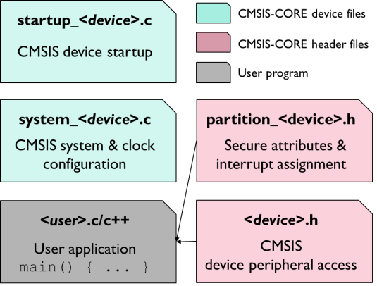
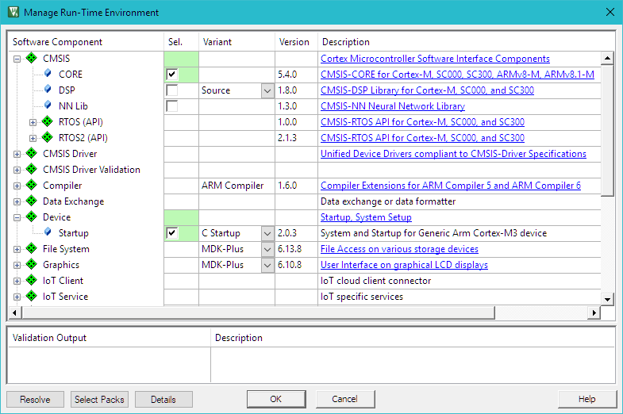
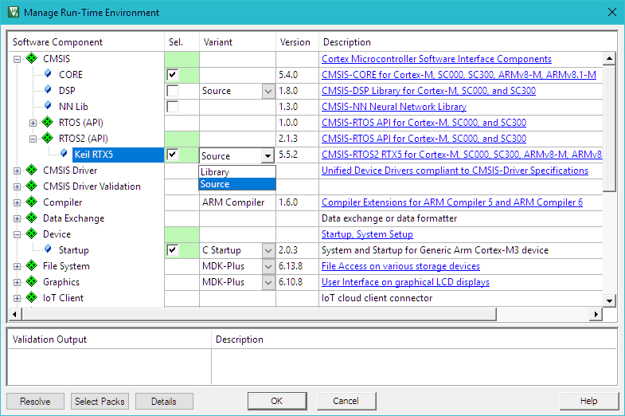
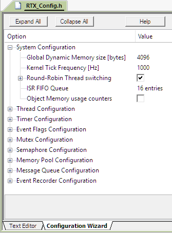
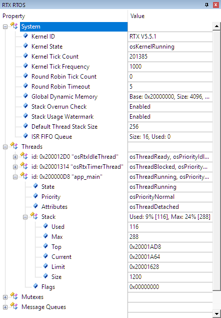

# Cortex 微控制器软件接口标准 (CMSIS)

**Cortex 微控制器软件接口标准 (CMSIS)** 提供了一个标准化的软件框架，用于在基于 **Cortex** 微控制器上运行的嵌入式应用。CMSIS使处理器和外设的软件接口变得**一致**且**简单**，简化了软件重用，降低了微控制器开发者的学习曲线。

CMSIS 根据 Apache 2.0 许可证提供，并在 GitHub 上公开开发：[https://github.com/ARM-software/CMSIS_5](https://github.com/ARM-software/CMSIS_5)。

!!! 注意
    本章是一个参考部分。第44页的“创建应用程序”章节将向您展示如何使用CMSIS创建应用程序代码。

CMSIS 提供了一种共同的方法来接口外设、实时操作系统和中间件组件。CMSIS 应用软件组件包括：

- **CMSIS-CORE:** 定义了Cortex-M处理器核和外设的API，并包含一致的系统启动代码。软件组件 **::CMSIS:CORE** 和 **::Device:Startup** 是在使用例外、中断和设备外设的原生处理器上创建和运行应用程序所需的全部。

- **CMSIS-RTOS2:** 提供了标准化的实时操作系统API，并支持可跨支持的RTOS系统使用的软件模板、中间件库和其他组件。本手册解释了Keil RTX5实现的用法。

- **CMSIS-DSP:** 是用于 **数字信号处理 (DSP)** 的库集合，具有60多个各种数据类型的函数：**固定点（分数 q7、q15、q31）** 和单精度 **浮点数（32位）**。

- **CMSIS-Driver:** 是一个描述中间件组件和用户应用程序的外设驱动程序接口的软件API。CMSIS-Driver API 设计为通用的，并且独立于特定的RTOS，使其可在广泛支持的微控制器设备范围内重复使用。

- **CMSIS-Zone:** 定义了描述和将系统资源划分为多个项目和执行区域的方法。系统资源可以包括多个处理器、内存区域、外设和相关中断。

## CMSIS-CORE
本部分解释了在运行在 Cortex-M 处理器上的应用程序中使用CMSIS-CORE。这种操作方式被称为 **裸机 (bare-metal)**，因为它不使用实时操作系统。

### 使用 CMSIS-CORE

使用CMSIS的本地Cortex-M应用程序使用软件组件 **::CMSIS:CORE**，应与软件组件 **::Device:Startup** 一起使用。这些组件提供以下关键文件：

{: width="100%"}

- 具有复位处理程序和异常向量的 startup_<device>.s 文件。
- 用于基本设备设置的 system_<device>.c 配置文件。
- 用户代码访问微控制器设备的 <device>.h 头文件。该文件包含：
    - 具有标准寄存器布局的外设访问。
    - 访问中断和异常，以及嵌套中断向量控制器（NVIC）。
    - 生成特殊指令的内在函数，例如激活睡眠模式。
    - Systick定时器（SYSTICK）函数，用于配置和启动周期定时器中断。
    - 通过片上CoreSight进行printf风格I/O和ITM通信的调试访问。

- partition_<device>.h 头文件包含在Armv8-M系统中配置TrustZone硬件的初始设置（参见“安全/非安全编程”部分）。

!!! 注意
    在实际文件名中，<device>是微控制器设备的名称。

### 将 CMSIS-CORE 组件添加到项目中

使用 µVision 对话框 **Manage Run-Time Environment** 将组件 **::CMSIS:CORE** 和 **::Device:Startup** 的文件添加到项目中。只需选择如下所示的软件组件：

{: width="100%"}

µVision 环境将添加相关的文件。

### 源代码示例

以下源代码行展示了CMSIS-CORE层的使用。

```c
#include "stm32f4xx.h"       // 根据使用的设备选择文件名
uint32_t volatile msTicks;   // 毫秒间隔的计数器
uint32_t volatile frequency; // 定时器频率
void SysTick_Handler(void)
{              // SysTick中断处理程序
    msTicks++; // 计数器增加
}
void WaitForTick(void)
{
    uint32_t curTicks;
    curTicks = msTicks; // 保存当前SysTick值
    while (msTicks == curTicks)
    {            // 等待下一个SysTick中断
        __WFE(); // 电源关闭，直到下一个事件
    }
}
void TIM1_UP_IRQHandler(void)
{     // 定时器中断处理程序
    ; // 在此添加用户代码
}
void timer1_init(int frequency)
{                                      // 设置定时器（特定于设备）
    NVIC_SetPriority(TIM1_UP_IRQn, 1); // 设置定时器优先级
    NVIC_EnableIRQ(TIM1_UP_IRQn);      // 启用定时器中断
}
// 配置和初始化MCU
void Device_Initialization(void)
{
    if (SysTick_Config(SystemCoreClock / 1000))
    { // SysTick 1ms
 : // 处理错误
    }
    timer1_init(frequency); // 设置设备特定的定时器
}
// 处理器时钟由CMSIS启动 + 系统文件初始化
int main(void)
{                            // 用户应用程序从这里开始
    Device_Initialization(); // 配置和初始化MCU
    while (1)
    {                    // 无尽循环（超级循环）
        __disable_irq(); // 禁用所有中断
        // Get_InputValues ();
        __enable_irq(); // 启用所有中断
        // Process_Values ();
        WaitForTick(); // 同步到SysTick定时器
    }
}
```
要获取更多信息，请右键单击项目窗口中的CMSIS组，选择打开文档，或参考 CMSIS-CORE 文档 arm-software.[github.io/CMSIS_5/Core/html/index.html](https://github.io/CMSIS_5/Core/html/index.html)。

## CMSIS-RTOS2

这一部分介绍了CMSIS-RTOS2 API和Keil RTX5实时操作系统，描述了它们的特性和优势，并解释了Keil RTX5的配置设置。

!!! 注意
    MDK兼容许多第三方RTOS解决方案。然而，CMSIS-RTOS Keil RTX5具有丰富的功能，专为深度嵌入式系统的要求而定制。而且，它与MDK紧密集成。虽然CMSIS-RTOS Keil RTX5是开源的，但也提供了经过功能安全认证的变体，适用于功能安全应用。请参阅keil.com/fusa-rts获取详细信息。

### 软件概念
嵌入式应用有两种基本的设计概念：

- **无限循环设计**：涉及将程序运行为无尽循环。程序功能（线程）从循环内调用，而中断服务例程（ISRs）执行一些数据处理等时关键的工作。

- **RTOS设计**：涉及使用**实时操作系统（RTOS）**运行**多个线程**。RTOS提供**线程间通信**和**时间管理功能**。抢占式RTOS减少了中断函数的复杂性，因为高**优先级**线程可以执行时关键的数据处理。

#### 无限循环设计
在无尽循环中运行嵌入式程序对于简单的嵌入式应用是一种足够的解决方案。**时关键函数**通常由硬件中断触发，在执行中断服务例程（ISR）时执行任何必需的数据处理。**主循环只包含一些不是时关键且在后台运行的基本操作。**

#### RTOS内核的优势
**RTOS内核**，如Keil RTX5，基于**并行执行线程（任务）**的概念。与现实世界一样，您的应用程序将不得不执行多个不同的任务。基于RTOS的应用程序通过多种方式在软件中重新创建此模型，具有各种优势：

- RTOS可靠地处理**线程优先级**和**运行时调度**。 - RTOS为线程间提供了一个明确定义的**通信接口**。

- **抢占式**多任务概念简化了应用程序的渐进性增强，即使在更大的开发团队中也是如此。可以在不影响更关键线程的响应时间的情况下添加新功能。

- 无限循环软件概念通常轮询已发生的中断。相比之下，RTOS内核本身是基于中断驱动的，可以大大消除轮询。这使CPU可以更频繁地休眠或处理线程。

**现代RTOS内核对中断系统是透明的**，这对于具有硬实时要求的系统是强制性的。通信设施可用于IRQ到任务的通信。

### 使用Keil RTX5
Keil RTX 5将CMSIS-RTOS API v2作为Cortex-M处理器设备的本机RTOS接口实现。 
一旦执行到*main()*，建议按照以下顺序初始化硬件并启动内核。您的应用程序的*main()*应按照以下顺序至少实现以下功能：

1. 初始化和配置硬件，包括外设、存储器、引脚、时钟和中断系统。

2. 使用相应的CMSIS-CORE函数更新SystemCoreClock。

3. 使用osKernelInitialize初始化CMSIS-RTOS内核。

4. 可选地，使用osThreadNew创建一个名为app_main的新线程，该线程用作主线程。或者，线程可以直接在main()中创建。

5. 使用osKernelStart启动RTOS调度程序。在成功执行的情况下，osKernelStart不返回。除非osKernelStart失败，否则在osKernelStart之后的任何应用程序代码都不会执行。

软件组件 **::CMSIS:RTOS2 (API):Keil RTX5** 必须与在CMSIS-CORE部分中解释的 **::CMSIS:CORE** 和 **::Device:Startup** 组件一起使用。

Keil RTX5的核心文件包括：

- 头文件cmsis_os2.h通过CMSIS-RTOS2 API向用户应用程序公开RTX功能。

- 配置文件RTX_Config.c/.h定义线程选项、定时器配置和RTX内核设置。

- 文件RTX_<core>.lib包含带有RTOS功能的库，并在将RTX5用作库变体时包含。在这种情况下，rtx_lib.c文件包含RTX5库的配置。

“项目与CMSIS-RTOS2”部分提供了一个基于Keil RTX5设置项目的示例。

#### 将Keil RTX5组件添加到项目
通过µVision对话框“管理运行时环境”将组件 **::CMSIS:RTOS2 (API):Keil RTX5**、**::CMSIS:CORE** 和 **:Device:Startup** 的文件添加到项目中。只需如下所示选择软件组件：

{: width="100%"}

Keil RTX5的库变体具有更为紧凑的代码，而源变体允许进行完整的程序调试，并通过事件记录支持RTOS感知调试。

#### CMSIS-RTOS2 API函数
文件cmsis_os2.h是一个标准头文件，定义了与每个CMSIS-RTOS API v2兼容的RTOS的接口。

头文件中的所有定义都以os为前缀，为CMSIS-RTOS函数提供唯一的命名空间。

所有属于模块的定义和函数都被分组，并具有共同的前缀，例如，线程的前缀是osThread。

有关更多信息，请参阅在线文档 [arm-software.github.io/CMSIS_5/RTOS2/html/index.html](https://arm-software.github.io/CMSIS_5/RTOS2/html/index.html) 中的“参考：CMSIS-RTOS2 API”部分。

#### Keil RTX5配置
文件RTX_Config.h包含Keil RTX5的配置参数。每个使用RTX组件的项目都包含此文件的副本。

{: width="60%"}

您可以设置各种系统参数，如Tick Timer频率、Round-Robin时间片，指定特定RTOS对象的配置，如线程、定时器、事件标志、互斥体、信号量、内存池和消息队列，以及配置Event Recorder操作。

有关配置选项的更多信息，请从“管理运行时环境”窗口中打开RTX文档。部分“配置RTX v5”描述了所有可用的设置： [arm-software.github.io/CMSIS_5/RTOS2/html/config_rtx5.html](https://arm-software.github.io/CMSIS_5/RTOS2/html/config_rtx5.html)。

#### CMSIS-RTOS用户代码模板

MDK提供了用户代码模板，可用于创建应用程序的C源代码。

在项目窗口中，右键单击一个组，选择“添加新项目到组”，选择“用户代码模板”，选择任何模板，然后点击“添加”。

{: width="100%"}

#### 源代码示例

一旦这些文件成为项目的一部分，开发人员就可以开始使用CMSIS-RTOS2 RTX函数。以下是一个代码示例，展示了如何使用CMSIS-RTOS RTX函数。

```c
#include "cmsis_os2.h" // CMSIS RTOS2头文件
void app_main(void *argument)
{
    tid_phaseA = osThreadNew(phaseA, NULL, NULL);
    osDelay(osWaitForever);
    while (1)
        ;
}
int main(void)
{
    // 系统初始化
    SystemCoreClockUpdate();
    osKernelInitialize();              // 初始化CMSIS-RTOS
    osThreadNew(app_main, NULL, NULL); // 创建应用程序主线程
    if (osKernelGetState() == osKernelReady)
    {
        osKernelStart(); // 启动线程执行
    }
    while (1)
        ;
}
```

在“使用Keil RTX5的项目”部分详细解释了如何使用Keil RTX5设置基于RTOS的应用程序。

### 用于RTX RTOS的组件查看器

Keil RTX5配备了一个SCVD文件，用于RTOS感知调试的组件查看器。在调试器中，打开View – Watch Windows – RTX RTOS。该窗口显示系统状态信息和运行中的线程。

{: width="80%"}

System属性显示应用程序中RTOS配置的一般信息。 Threads属性显示应用程序线程执行的详细信息。对于每个线程，它显示有关优先级、执行状态和堆栈使用情况的信息。如果在文件RTX_Config.h的**Thread Configuration**中启用了**Stack usage watermark**选项，Stack字段将显示堆栈负载。这使您能够：
- 在线程执行期间识别堆栈溢出，或
- 优化并减少线程使用的堆栈空间。

关于其他RTX5对象（例如互斥体、信号量、消息队列）的信息也在相应的属性中提供。

!!! 注意
    µVision调试器还提供了一个带有详细运行时信息的视图。有关更多信息，请参阅第74页上的事件记录。

## CMSIS-DSP

CMSIS-DSP库是一套常见的数字信号处理（DSP）函数。该库提供了多个优化用于不同arm Cortex-M处理器的变体。

在“管理运行时环境”对话框中启用软件组件 **::CMSIS:DSP** 时，将自动将适用于所选设备的相应库包含到项目中。还可以选择源代码变体。

{: width="100%"}

下面的代码示例显示了CMSIS-DSP库函数的使用。

使用DSP函数相乘两个矩阵

```c
#include "arm_math.h" // ARM::CMSIS:DSP
const float32_t buf_A[9] = {
    // Matrix A buffer and values
    1.0,
    32.0,
    4.0,
    1.0,
    32.0,
    64.0,
    1.0,
    16.0,
    4.0,
};
float32_t buf_AT[9];          // Buffer for A Transpose (AT)
float32_t buf_ATmA[9];        // Buffer for (AT * A)
arm_matrix_instance_f32 A;    // Matrix A
arm_matrix_instance_f32 AT;   // Matrix AT(A transpose)
arm_matrix_instance_f32 ATmA; // Matrix ATmA( AT multiplied by A)
uint32_t rows = 3;            // Matrix rows
uint32_t cols = 3;            // Matrix columns
int main(void)
{
    // Initialize all matrixes with rows, columns, and data array
    arm_mat_init_f32(&A, rows, cols, (float32_t *)buf_A); // Matrix A
    arm_mat_init_f32(&AT, rows, cols, buf_AT);            // Matrix AT
    arm_mat_init_f32(&ATmA, rows, cols, buf_ATmA);        // Matrix ATmA
    arm_mat_trans_f32(&A, &AT);                           // Calculate A Transpose (AT)
    arm_mat_mult_f32(&AT, &A, &ATmA);                     // Multiply AT with A
    while (1)
        ;
}
```

有关更多信息，请参阅CMSIS-DSP文档 [https://arm-software.github.io/CMSIS_5/DSP/html/index.html](https://arm-software.github.io/CMSIS_5/DSP/html/index.html)。

## CMSIS-Driver

特定设备的CMSIS驱动程序提供了中间件和微控制器外设之间的接口。这些驱动程序不仅限于MDK中间件，对于各种其他中间件堆栈，这些驱动程序也非常有用，以利用这些外设。

特定设备的驱动程序通常是支持微控制器设备的软件包的一部分，并符合CMSIS-Driver标准。在https://developer.arm.com/embedded/cmsis/cmsis-packs/devices/的设备数据库上列出了软件包中包含的驱动程序。

{: width="100%"}

中间件组件通常具有连接到这些驱动程序的各种配置文件。根据设备，RTE_Device.h文件配置驱动程序以实际引脚连接到微控制器设备。一些设备需要特定的第三方工具来正确配置硬件。
中间件/应用代码通过控制结构连接到驱动程序实例。此控制结构的名称反映了设备的外围接口。大多数通信外设的驱动程序都包含在提供设备支持的软件包中。

使用传统的C源代码按照CMSIS-Driver标准实现缺失的驱动程序。
有关这些CMSIS驱动程序的API接口的详细信息，请参阅 [arm-software.github.io/CMSIS_5/Driver/html/index.html](https://arm-software.github.io/CMSIS_5/Driver/html/index.html)。

**ARM::CMSIS-Driver** 软件包包含了一些接口的示例CMSIS驱动程序实现，如WiFi、Ethernet、Flash、I2C和SPI。

### 配置
有多种配置CMSIS-Driver的方法。传统的方法是使用随设备支持一起提供的 ***RTE_Device.h*** 文件。

其他设备可以使用第三方图形配置工具进行配置，允许用户配置设备引脚位置及其相应的驱动程序。通常，这些配置工具会自动生成所需的C代码，以便导入µVision项目。

#### 使用RTE_Device.h
对于大多数设备，RTE_Device.h文件配置驱动程序以实际引脚连接到微控制器设备：

{: width="100%"}

使用Configuration Wizard视图，您可以在图形模式下配置驱动程序接口，无需手动编辑此头文件中的 #define。

#### 使用STM32CubeMX

MDK支持使用STM32CubeMX对STM32设备进行CMSIS-Driver配置。这个图形化软件配置工具允许您使用STMicroelectronics设备的图形向导生成C初始化代码。

只需在“管理运行时环境”窗口中选择所需的CMSIS-Driver，然后选择 **Device:STM32Cube Framework (API):STM32CubeMX**。这将打开STM32CubeMX以进行设备和驱动程序配置。完成后，生成配置代码并将其导入µVision。

有关更多信息，请访问keil.com/pack/doc/STM32Cube/General/html/index.html的在线文档。

## 针对驱动程序和RTOS的验证套件

用户编写的CMSIS驱动程序或CMSIS-RTOS的新实现可以使用keil.com/pack上提供的软件包进行验证。这些软件包包含验证套件的源代码和文档，以及所需的配置文件和在各种目标平台上展示用法的示例。

CMSIS-Driver验证套件执行以下测试：
- API函数调用的通用验证
- 配置参数的验证
- 通过回环测试验证通信
- 验证通信参数，如波特率
- 验证事件函数

测试结果可以打印到控制台，通过ITM printf输出，或输出到内存缓冲区。有关文档，请参阅 [arm-software.github.io/CMSIS_5/Driver/html/driverValidation.html](https://arm-software.github.io/CMSIS_5/Driver/html/driverValidation.html) 中的“Driver Validation”部分。

CMSIS-RTOS验证套件对各种RTOS功能执行通用验证。测试用例验证功能行为，测试无效参数，并从ISR调用管理函数。

验证输出可以打印到控制台，通过ITM printf输出，或输出到内存缓冲区。有关文档，请参阅 [arm-software.github.io/CMSIS_5/RTOS2/html/rtosValidation.html](https://arm-software.github.io/CMSIS_5/RTOS2/html/rtosValidation.html) 中的“RTOS Validation”部分。
