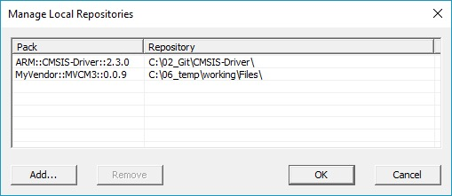
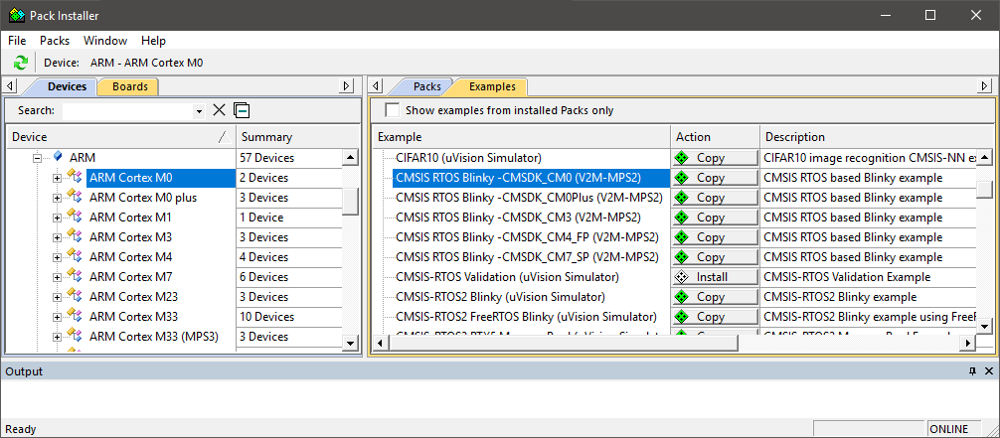

# ARM Microcontroller Development Kit (MDK) INTRODUCTION

MDK helps you to create embedded applications for more than 7,500 ArmCortex-M processor-based devices. MDK is a powerful, yet easy to learn and use development system. It consists of MDK-Core and software packs, which can be downloaded and installed based on the requirements of your application.

## MDK Tools
The **MDK Tools** include all the components that you need to **create**, **build**, and **debug** an embedded application for Arm based microcontroller devices. **MDK-Core** consists of the **Keil µVision IDE and debugger** with leading support for Cortex-M processor-based microcontroller devices. 

MDK includes the **Arm C/C++ Compiler with assembler**, **linker**, and highly optimize **run-time libraries** tailored for optimum code size and performance. ArmCompiler version 6 is based on the innovative LLVM technology and supports the latest C language standards including C++11 and C++14. It is also available with a TÜV certified qualification kit for safety applications, as well as long-term support and maintenance.

## Software Packs
Software packs contain **device support**, **CMSIS components**, **middleware**, **board support**, **code templates**, and **example projects**. They **may be added any time** to MDK-Core, making new device support and middleware updates independent from the toolchain. µVision IDE manages the provided software components that are available for the application as building blocks.

## MDK Editions
The product selector, available at [keil.com/editions](https://www.keil.com/), gives an overview of the features enabled in each edition:

- MDK-Lite is code size restricted to 32 KByte and intended for product evaluation, small projects, and the educational market.

- MDK-Essential supports all Cortex-M processor-based microcontrollers up to Cortex-M55.

- MDK-Plus adds middleware libraries for IPv4 networking, USB Device, File System, and Graphics. It supports Arm Cortex-M, Arm Cortex-R4, ARM7, and ARM9 processor-based microcontrollers.

- MDK-Professional contains all features of MDK-Plus. In addition, it supports IPv4/IPv6 dual-stack networking and a USB Host stack. It also gives access to the safety-qualified version of the Arm Compiler with all required documents and certificates.

## License Type
Apart from MDK-Lite, all MDK editions require activation using a license code. The following licenses types are available:

1. Single-user license (node-locked) grants the right to use the product by one developer on two computers at the same time.

2. Floating-user license or FlexNet license grants the right to use the product on different computers by several developers at the same time.

For further details, refer to the Licensing User’s Guide at 
keil.com/support/man/docs/license.

## Installation

### Software and Hardware Requirements
MDK has the following minimum hardware and software requirements:
- A PC running a current Microsoft Windows desktop operating system
(32-bit or 64-bit)
- 4 GB RAM and 8 GB hard-disk space
- 1280 x 800 or higher screen resolution; a mouse or other pointing device
Exact requirements can be found at keil.com/system-requirements/

### Install MDK
Download MDK from keil.com/demo/eval/arm.htm and run the installer.
Follow the instructions to install MDK on your local computer. The installation also adds the software packs for Arm CMSIS, Arm Compiler and MDK-Middleware.
After the MDK installation is complete, the Pack Installer starts automatically, which allows you to add supplementary software packs. As a minimum, you need to install a software pack that supports your target microcontroller device.

!!! note
    MDK version 5 can use MDK version 4 projects after installation of the **legacy support** from keil.com/mdk5/legacy. This adds support for Arm7, Arm9, and Cortex-R processor-based devices.

- [ ] To try

### Install Software Packs
The Pack Installer manages software packs on the local computer. The software packs are stored in the pack root folder (default: %localappdata%\Arm\Packs).

The Pack Installer runs automatically during the installation, but also can be run from µVision using the menu item Project – Manage – Pack Installer. To get access to devices and example projects, install the software pack related to your target device or evaluation board.

!!! note
    To obtain information of published software packs the Pack Installer connects to keil.com/pack.

The status bar at the bottom of the Pack Installer, shows information about the Internet connection and the installation progress.

!!! tip
    The device database lists all supported devices and provides download access to the related software packs. It is available at https://developer.arm.com/embedded/cmsis/cmsis-packs/devices. If the Pack Installer does not have Internet access, you can manually install software packs using the menu command File – Import or by double clicking *.PACK files.

#### Manage Local Repositories
While developing a software pack, it is useful to quickly verify how it works in a µVision project without re-building and re-installing the pack after every modification.

For this purpose, the folder with the pack’s content shall be added to the list of managed local repositories. To do this use the Pack Installer menu File - Manage Local Repositories..., click Add..., select the PDSC file in the pack folder and press OK:

To ensure that the changes to the pack are applied in the project reload the packs using µVision menu Project - Manage - Reload Software Packs.

### MDK-Professional Trial License
MDK has a built-in functionality to request a thirty-day trial license for MDK-Professional. This removes the code size limits and you can explore and test the comprehensive middleware.
Start µVision with administration rights.

In µVision, go to File – License Management... and click Evaluate MDK Professional

A window opens that shows you the data that is submitted to the Arm Keil server to generate your personal license key

When you click OK, your browser opens, and you are directed to a registration page. Confirm that the information is correct by clicking the Submit button.

Once done, you receive an email from the Keil web server with the license number for your evaluation.
In µVision’s License Management dialog, enter the value in the New License ID Code (LIC) field and click Add LIC:

Now you can use MDK-Professional for thirty days.

### Verify Installation using Example Projects
Once you have selected, downloaded, and installed a software pack for your device, you can verify your installation using one of the examples provided in the software pack. To verify the software pack installation, we recommend using a Blinky example, which typically flashes LEDs on a target board.

!!! tip
    Review the getting started video on keil.com/mdk5/install that explains how to connect and work with an evaluation kit.

#### Copy an Example Project
In the Pack Installer, select the tab Examples. Use Search fielad in the toolbar to narrow the list of examples.

Click Copy and enter the Destination Folder name of your working directory.

!!! note
    You must copy the example projects to a working directory of your choice.

- Enable Launch µVision to open the example project directly in the IDE.
- Enable Use Pack Folder Structure to copy example projects into a common folder. This avoids overwriting files from other example projects. Disable Use Pack Folder Structure to reduce the complexity of the example path.
- Click OK to start the copy process.

#### Use an Example Application with µVision
µVision starts and loads the example project where you can:

- Build the application, which compiles and links the related source files.
- Download the application, typically to on-chip Flash ROM of a device.
- Run the application on the target hardware using a debugger.

The step-by-step instructions show you how to execute these tasks. After copying the example, µVision starts and looks like the picture below.

!!! tip
    Most example projects contain an Abstract.txt file with essential information about the operation and hardware configuration.

#### Build the Application

Build the application using the toolbar button Rebuild.

The Build Output window shows information about the build process. An error-free build shows information about the program size.

#### Download the Application

Connect the target hardware to your computer using a debug adapter that typically connects via USB. Several evaluation boards provide 
an on-board debug adapter.

Now, review the settings for the debug adapter. Typically, example projects are pre-configured for evaluation kits; thus, you do not need to modify these settings.

Click **Options for Target** on the toolbar and select the Debug tab. Verify that the correct debug adapter of the evaluation board you are using is selected and enabled. For example, **CMSIS-DAP Debugger** is a common on-board debug adapter for various starter kits.

Enable **Load Application** at Startup for loading the application into the µVision debugger whenever a debugging session is started.

Enable **Run to main()** for executing the instructions up to the first executable statement of the main() function. The instructions are executed upon each reset.

!!! tip
    Click the button Settings to verify communication settings and diagnose problems with your target hardware. For further details, click the button Help in the dialogs. If you have any problems, refer to the user guide of the starter kit.

Click Download on the toolbar to load the application to your target hardware.

The **Build Output** window shows information about the download progress.

#### Run the Application
Click **Start/Stop Debug Session** on the toolbar to start debugging the application on hardware.

Click **Run** on the debug toolbar to start executing the application. LEDs should flash on the target hardware.

## Access Documentation
MDK provides online manuals and context-sensitive help. The µVision **Help** menu opens the main help system that includes the *µVision User’s Guide*, getting started manuals, compiler, linker and assembler reference guides.

Many dialogs have context-sensitive **Help** buttons that access the documentation and explain dialog options and settings.

You can press **F1** in the editor to access help on language elements like RTOS functions, compiler directives, or library routines. Use **F1** in the command line of the **Output** window for help on debug commands, and some error and warning messages.

The **Books** window may include device reference guides, data sheets, or board manuals. You can even add your own documentation and enable it in the Books window using the menu **Project – Manage – Components, Environment, Books – Books**.

The **Manage Run-Time Environment** dialog offers access to documentation via links in the *Description* column.

In the **Project** window, you can right-click a software component group and open the documentation of the corresponding element.
Access the **µVision User’s Guide** on-line: keil.com/support/man/docs/uv4.

## Request Assistance
If you have suggestions or you have discovered an issue with the software, please report them to us. Support information can be found at keil.com/support.
When reporting an issue, include your license code (if you have one) and product version, available from the µVision menu Help – About.

## Online Learning

Our **keil.com/learn** website helps you to learn more about the programming of Arm Cortex-based microcontrollers. It contains tutorials, further documentation, as well as useful links to other websites.

Selected videos showing the tools and different aspects of software development are available at **keil.com/video**.