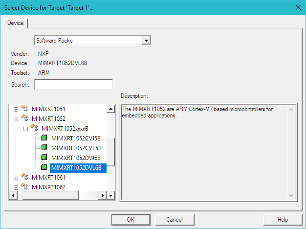
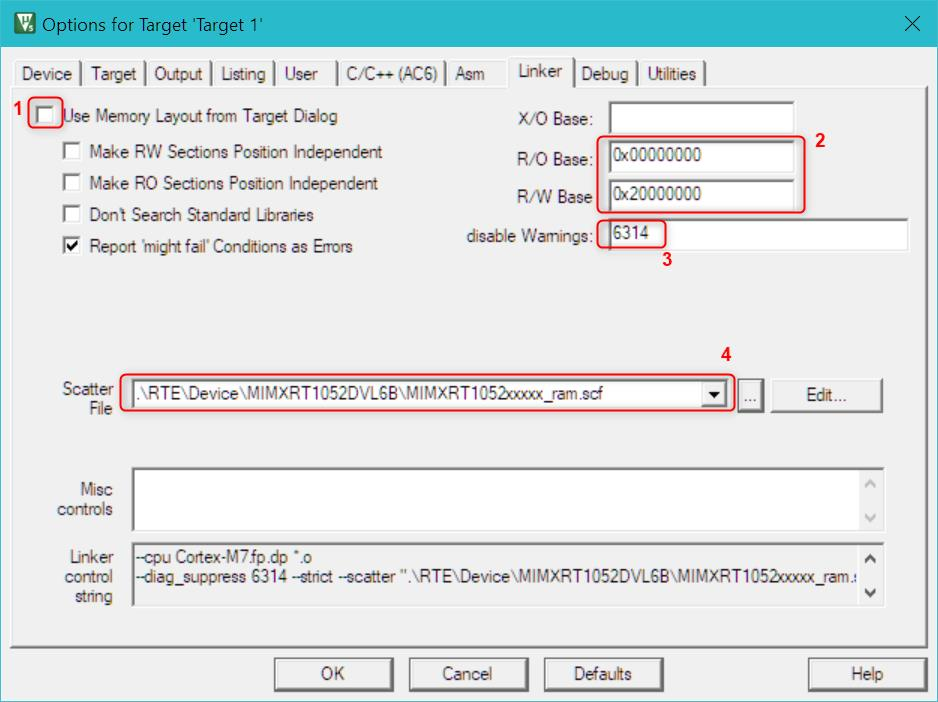
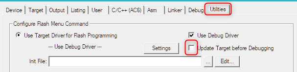
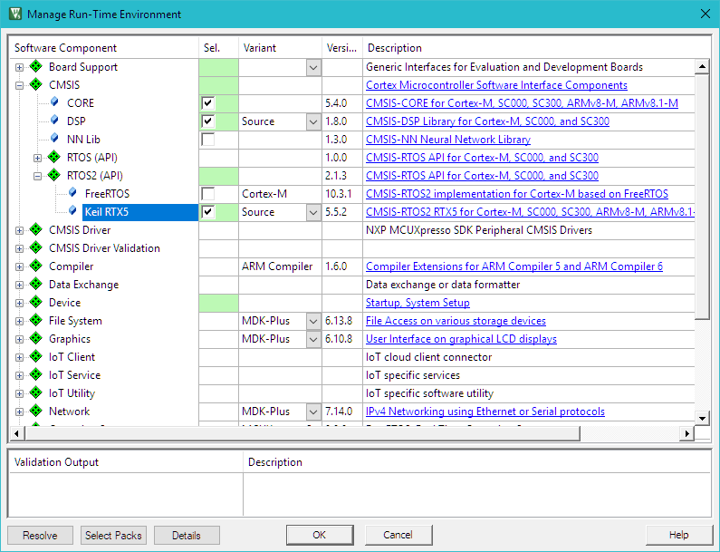
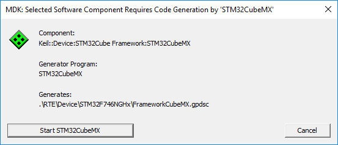
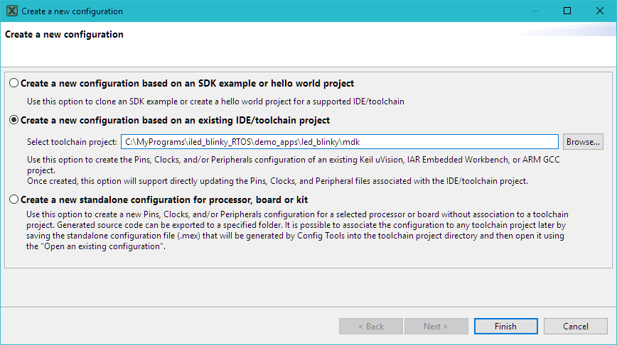
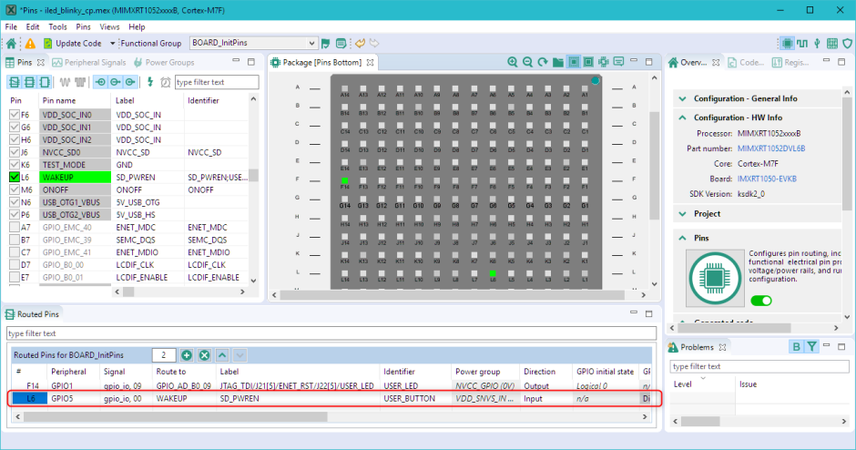
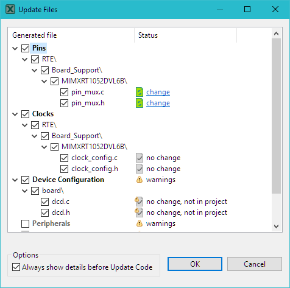

# Create Applications

This chapter guides you through the steps required to create a projects using  **CMSIS**  components described in the previous chapter.

For many popular development boards MDK already provides ready-to-use CMSIS based examples. It is always beneficial to take such an example as a starting point as explained in **Verify Installation using Example Projects** and then modify it for own application needs.

Device vendors may also provide MDK example applications in separate deliverables not indexed in the MDK Pack Installer explained in Install Software Packs. Development and configuration tools from device vendors may also allow export of application projects into Keil MDK format. These two options should be explored if no examples are found in MDK Pack Installer.

This chapter is structured as follows:

- Section **µVision Project from Scratch** explains how to start a new project from scratch and can be followed when there is no example applications available.

- Section **Project with CMSIS-RTOS2** shows how to easily convert an existing application with infinite loop design into Real-Time OS based system using CMSIS-RTOS2 API.

- **Device Configuration Variations** explains integrations with device vendor tools for device startup.

- Finally, section **Secure/non-secure programming** guides through the project setup for devices based on Armv8-M architecture.

!!! note
    The example code in this chapter works for the MIMXRT1050-EVK evaluation board (populated with MIMXRT1052DVL6B device). Adapt the code for other starter kits or boards.

## µVision Project from Scratch

This section describes the steps for setting up a new CMSIS based project from scratch:

- **Setup New µVision Project:** create a project file and select the microcontroller device along with the relevant CMSIS components.

- **Add *main.c* Source Code File: **Add main.c file to the project with initial code for *main() function* and *device initialization*.

- **Configure Project Options:** adjust project settings to ensure that the project can be built correctly.

- **Build the Application Project:** compile and link the application for programming it onto the target microcontroller device.

- **Using the Debugger** guides you through the steps to connect your evaluation board to the PC and to download the application to the target.

### Setup New µVision Project

From the µVision menu bar, choose **Project – New µVision Project**.

Next, the dialog **Select Device for Target** opens.



Select the target device and, if necessary, the target CPU in a multi-core device. In our case this is MIMXRT1052DVL6B and click **OK**.

!!! tip
     If the target device is not available in the list – verify that the corresponding Device Family Pack (DFP) is installed as explained in **Install Software Packs**.

The device selection defines essential tool settings such as compiler controls, the memory layout for the linker, and the Flash programming algorithms. However,in some cases (especially for more complex devices) additional configurations are required to achieve correct project build and debug. This is explained in step **Configure Project Options**.

Then the **Manage Run-Time Environment** dialog opens and shows the software components that are installed and available for the selected device. Following components need to be added for CMSIS-based project:

Expand **::CMSIS** and enable **CORE**.

Expand **::Device::Startup** and enable one of the offered variants. In our 
case it is just one: MIMXRT1052_startup.


Other components can be added depending on the application needs. In our case we limit to the bare minimum.
The **Validation Output** field may show dependencies to other software components that are required based on the current selection. In such case click Resolve button to automatically resolve all dependencies and enable other required

!!! tip
    A click on a message highlights the related software component. In our example shown above there is no extra dependencies to resolve.

Click OK.

The selected software components are included into the project together with the device startup file and CMSIS system files. The Project window displays the selected software components along with the related files. Double-click on a file to open it in the editor.


### Add *main.c* Source Code File

Now we can add the main.c file with initial program code.

In the Project window, right-click Source Group 1 and open the dialog  Add New Item to Group.

Click on C File (.c) specify the file name, in our case main.c and click Add.


This creates the file main.c in the project group Source Group 1. Add following content to the file:

```c
/* ------------------------------------------------------------------
 * main.c file
 * ----------------------------------------------------------------*/
#include "RTE_Components.h"  // Component selection
#include CMSIS_device_header // Device header
uint32_t volatile msTicks;   // Counter for millisecond Interval
void SysTick_Handler(void)
{              // SysTick Interrupt Handler
    msTicks++; // Increment Counter
}
void WaitForTick(void)
{
    uint32_t curTicks;
    curTicks = msTicks; // Save Current SysTick Value
    while (msTicks == curTicks)
    {            // Wait for next SysTick Interrupt
        __WFE(); // Power-Down until next Event
    }
}
// Configure & Initialize the MCU
void Device_Initialization(void)
{
    SystemInit();            // Device initialization
    SystemCoreClockUpdate(); // Clock setup
    if (SysTick_Config(SystemCoreClock / 1000))
    {     // SysTick 1ms
        ; // Handle Error
    }
}
// The processor clock is initialized by CMSIS startup + system file
int main(void)
{                            // User application starts here
    Device_Initialization(); // Configure & Initialize MCU
    while (1)
    {                    // Endless Loop (the Super-Loop)
        __disable_irq(); // Disable all interrupts
        // Get_InputValues ();
        __enable_irq(); // Enable all interrupts
        // Process_Values ();
        WaitForTick(); // Synchronize to SysTick Timer
    }
}
```
For many devices the build process described in step **Build the Application Project** will succeed already after this this step. 
In some cases (and in our example for MIMXRT1052) additional changes in the project configurations are required as explained in **Configure Project Options** section below.

#### Device Initialization

System initialization in our simple example is done in the ***Device_initialization()***
function using only CMSIS-Core API.

Silicon vendors provide the device-specific file system_<device>.c (in our case 
system_MIMXRT2052.c) that implements SystemInit and SystemCoreClockUpdate functions. This file gets automatically added to the project with the selection of **::Device::Startup** component in the Manage Run-Time Environment in the previous step. 

Real-world examples often require complex configuration for pins and peripherals with a significant part of the system setup relying on the device **hardware abstraction layer (HAL) **provided by the vendor. 

Section **Device Configuration Variations** explains additional details and provides examples on device configuration using external tools.

### Configure Project Options

For some devices new projects cannot be built and programmed onto the device with default settings and require special configuration options. This is often a reason why starting with a ready-to-use example can be beneficial.

Click **Options for Target**... button on the toolbar to access the configuration options.

It contains multiple tabs that provide configuration options for corresponding functionality.


Changes required for getting started depend on the target device and software components used in the project. Subsections below explain the modifications required in the specified dialog tabs for the MIMXRT1052 used in our example.

#### C/C++ (AC6) dialog

To exclude mostly just informative warnings generated by the Arm Compiler 6 select AC5-like Warnings in the Warnings field of the C/C++ (AC6) tab.

#### Linker dialog

Complex devices or programs may require use of a scatter file to specify memory layout. The figure below highlights the changes required in our example:



1. Unchecking the flag Use Memory Layout from Target Dialog enables use 
of custom scatter file provided in the item 4 below.

2. R/O and R/W Bases define the start addresses for read only (code and 
constants) and read-write areas respectively.

3. Disable warning #6314 for unused memory objects.

4. The Device Family Pack (DFP) contains some preconfigured scatter files that 
are copied into the new project. To simplify project configuration, we will 
execute the program from the on-chip RAM and hence choose in the drop-down menu for the Scatter file the .\RTE\Device\MIMXRT1052DVL6B\MIMXRT1052xxxxx_ram.scf

#### Debug dialog

To ensure that the program loads to RAM and we can debug it, following changes are required in the Debug tab.


In the project folder create a new file that will be used to initialize the debug session (in our case - evkbimxrt1050_ram.ini) and provide path to it in the Initialization File field.

For this example, add the following content to the file:

```c
/*-------------------------------------------------------------------
* evkbimxrt1050_ram.ini file
*------------------------------------------------------------------*/
FUNC void Setup (void) {
 SP = _RDWORD(0x00000000); // Setup Stack Pointer
 PC = _RDWORD(0x00000004); // Setup Program Counter
 _WDWORD(0xE000ED08, 0x00000000); // Setup VTOR
}
FUNC void OnResetExec (void) { // executes upon software RESET
Setup(); // Setup for Running
}
LOAD %L INCREMENTAL // Download
Setup(); // Setup for Running
// g, main
```

#### Utilities dialog
In the Utilities dialog, uncheck the option **Update Target before Debugging** to ensure that the debugger doesn’t try to load program to Flash.



### Build the Application Project

Use Rebuild toolbar button to build the application, which compiles and links all related source files. Build Output shows information about the build process. An error-free build displays program size information, zero errors, and zero warnings.

The section **Debug Applications** guides you through the steps to connect your evaluation board to the PC and download the application to the target hardware.

## Project with CMSIS-RTOS2

The section shows how to setup a simple project based on CMSIS-RTOS2. The project uses device HAL to control on-board LED. To avoid making project configuration and device initialization from scratch we take an existing blinky example in infinite-loop design delivered with the DFP
and modify it to operate based on CMSIS-RTOS2 API. Following steps are required:

1. Copy an Example: copy an existing example and verify that it works
2. Add CMSIS-RTO2 Component: add CMSIS-RTOS2 API and RTX5 kernel to the
3. Add RTOS Initialization: add main.c file that initializes the device and RTOS.
4. Configure Keil RTX5 RTOS: modify the RTOS settings according to the application needs.
5. Implement User Threads: implement user code.
6. Build and Run the program: the step is same as explained in the previous section.
7. 
In our case we will use a simple iled_blinky example for IMXRT1050-EVK board.

### Copy an Example


Section **Verify Installation using Example Projects** explains the steps needed to copy, build and run an example project. In our example we use target iled_blinky debug that executes the program from on-chip RAM.

To build the project with the iled_blinky debug target, the SPI flash related file *fsl_flexspi_nor_boot.c* has to be excluded from the build. 

Find this file in the **Project** window under **Device** component, right-click on it, then select **Options for Component Class ‘Device’** and in the **Properties** tab uncheck **Include in target build**. Press **OK**. The file will be marked with a corresponding symbol.

### Add CMSIS-RTOS2 Component

Next, add the RTOS software component:

Expand **::CMSIS::RTOS2 (API)** and enable **Keil RTX5**. In the **Variant** 
column select **Source** to have the RTOS added to the project as a source 
code that also supports detailed debugging using Event Recorder. For 
reduced code size, use the **Library** variant instead. Press **OK**.



Keil RTX5 code appears in the Project window under CMSIS component.

In our case for MIMRT1052 we need to change the **Assembler Option** so that Keil RTX5 file **irq4_cm4f.s** can be assembled correctly.

For that go to the **Options for Target.. – Asm** tab and in the dropdown menu **Assembler Option** select **armclang (Auto Select)** instead of **armclang (GNU Syntax)** configured by default in the original example. 
Press **OK**.

Alternatively, the assembler option can be specified for the irq4_cm4f.s file only. For that find this file in the **Project** window under **CMSIS** component, right-click on it, then select **Options for Component Class ‘CMSIS’** and in the **Asm** tab choose **armclang (Arm Syntax)** from the drop-down menu in **Assembler Option** field. Press OK.

### Add RTOS Initialization

Add template application code using pre-configured **User Code Templates** containing routines that resemble the functionality of the software component.

In the Project window, right-click in the group with the source code (in our case source and open the dialog Add New Item to Group).

Click on **User Code Template** to list available code templates for the software components included in the project. Select **CMSIS-RTOS2 ‘main’ function**, verify the file name, and click **Add**.


Click on User Code Template to list available code templates for the software components included in the project. Select CMSIS-RTOS2 ‘main’ function, verify the file name, and click Add.

We reuse the device initialization functions from the original main() function. We remove the implementation of app_main function as it will be placed in the other file. As a result, the main.c file contains following code:

```c
/*-------------------------------------------------------------------
 * CMSIS-RTOS 'main' function template
 *------------------------------------------------------------------*/
#include "RTE_Components.h"
#include CMSIS_device_header
#include "cmsis_os2.h"
#include "board.h"
#include "pin_mux.h"
extern void app_main(void *argument); // application main thread
int main(void)
{
    /* Board pin init */
    BOARD_InitPins();
    BOARD_InitBootClocks();
    // System Initialization
    SystemCoreClockUpdate();
    // ...
    osKernelInitialize();              // Initialize CMSIS-RTOS
    osThreadNew(app_main, NULL, NULL); // Create application main thread
    osKernelStart();                   // Start thread execution
    for (;;)
    {
    }
}
```

Note the ***Board_InitPins()*** and ***Board_InitBootClocks()*** functions that configure the underlying MIMXRT1052 device. Section Example: MCUXpresso Config Tools explains device configuration in more details.

### Configure Keil RTX5 RTOS

In Project window - CMSIS group open RTX_Config.h file and configure according to the project requirements as explained in Keil RTX5 Configuration. In our example we can keep default settings.

### Implement User Threads

The file led_blinky.c, containing the initial main() function, can now be rewritten using RTOS threads. We implement two user threads: *thrLED* toggling the LED and *thrSGN* acting as a signal thread that triggers thrLED thread with regular delays.

```c
/*-------------------------------------------------------------------
 * led_blinky.c file
 *------------------------------------------------------------------*/
#include "cmsis_os2.h"
#include "fsl_gpio.h"
#include "pin_mux.h"
#include "board.h"
static osThreadId_t tid_thrLED; // Thread id of thread: LED
static osThreadId_t tid_thrSGN; // Thread id of thread: SGN
/*---------------------------------------------------------------------
 thrLED: blink LED
*-------------------------------------------------------------------*/
__NO_RETURN static void thrLED(void *argument)
{
    (void)argument;
    uint32_t active_flag = 1U;
    for (;;)
    {
        osThreadFlagsWait(1U, osFlagsWaitAny, osWaitForever);
        GPIO_PinWrite(BOARD_USER_LED_GPIO, BOARD_USER_LED_PIN, active_flag);
        active_flag = !active_flag;
    }
}
/*---------------------------------------------------------------------
 thrSGN: Signal LED to change
*--------------------------------------------------------------------*/
__NO_RETURN static void thrSGN(void *argument)
{
    (void)argument;
    uint32_t last;
    for (;;)
    {
        osDelay(500U);                    // Run delay for 500 ticks
        osThreadFlagsSet(tid_thrLED, 1U); // Set flag to thrLED
    }
}
/*---------------------------------------------------------------------
 * Application main thread
 *--------------------------------------------------------------------*/
void app_main(void *argument)
{
    (void)argument;
    tid_thrLED = osThreadNew(thrLED, NULL, NULL); // Create LED thread
    if (tid_thrLED == NULL)
    { /* add error handling */
    }
    tid_thrSGN = osThreadNew(thrSGN, NULL, NULL); // Create SGN thread
    if (tid_thrSGN == NULL)
    { /* add error handling */
    }
    osThreadExit();
}
```

## Device Configuration Variations

CMSIS-CORE defines methods for device startup such as *SystemInit()* and *SystemClock_Config()* but the actual implementation details vary between different vendors.

Some devices perform a significant part of the system setup as part of the device **hardware abstraction layer (HAL)**. In many cases the HAL components for the target platform are delivered as part of the **Device Family Pack (DFP)** and are available for selection in the Manage Run-Time Environment dialog, typically under **::Device component**. 

Device vendors frequently provide a software framework that allows device configuration with external utilities. 

In the following section, device startup variations are exemplified.

### Example: STM32Cube
Many **STM32 devices** are using the **STM32Cube framework** that can be configured with (1) a classical method using the **RTE_Device.h** configuration file or (2) by using **STM32CubeMX** tool. 

The classic **STM32Cube Framework** component provides a specific **user code template** that implements the system setup. Using STM32CubeMX, the main.c file and other source files required for startup are copied into the project below the **STM32CubeMX:Common Sources** group

#### Setup the Project using the Classic Framework

This example creates a project for the **STM32F746G-Discovery kit** using the classical method. In the Manage Run-Time Environment window, select the following:

Expand **::Device:STM32Cube Framework (API)** and enable **:Classic**.
Expand **::Device** and enable **:Startup**.


Click **Resolve** to enable other required software components and then **OK**.

In the Project window, right-click Source Group 1 and open the dialog Add New Item to Group.


Click on **User Code Template** to list available code templates for the software components included in the project. Select **‘main’ module for STM32Cube** and click Add.

The main.c file contains the function *SystemClock_Config()*. Here, you need to make the settings for the clock setup:

Code for main.c

```c
static void SystemClock_Config (void)
{
    RCC_ClkInitTypeDef RCC_ClkInitStruct;
    RCC_OscInitTypeDef RCC_OscInitStruct;
    /* Enable HSE Oscillator and activate PLL with HSE as source */
    RCC_OscInitStruct.OscillatorType = RCC_OSCILLATORTYPE_HSE;
    RCC_OscInitStruct.HSEState = RCC_HSE_ON;
    RCC_OscInitStruct.HSIState = RCC_HSI_OFF;
    RCC_OscInitStruct.PLL.PLLState = RCC_PLL_ON;
    RCC_OscInitStruct.PLL.PLLSource = RCC_PLLSOURCE_HSE;
    RCC_OscInitStruct.PLL.PLLM = 25;
    RCC_OscInitStruct.PLL.PLLN = 432;
    RCC_OscInitStruct.PLL.PLLP = RCC_PLLP_DIV2;
    RCC_OscInitStruct.PLL.PLLQ = 9;
    HAL_RCC_OscConfig(&RCC_OscInitStruct);
    /* Activate the OverDrive to reach the 216 MHz Frequency */
    HAL_PWREx_EnableOverDrive();
    /* Select PLL as system clock source and configure the HCLK, PCLK1 and
   PCLK2 clocks dividers */
    RCC_ClkInitStruct.ClockType = (RCC_CLOCKTYPE_SYSCLK | RCC_CLOCKTYPE_HCLK | RCC_CLOCKTYPE_PCLK1 | RCC_CLOCKTYPE_PCLK2);
    RCC_ClkInitStruct.SYSCLKSource = RCC_SYSCLKSOURCE_PLLCLK;
    RCC_ClkInitStruct.AHBCLKDivider = RCC_SYSCLK_DIV1;
    RCC_ClkInitStruct.APB1CLKDivider = RCC_HCLK_DIV4;
    RCC_ClkInitStruct.APB2CLKDivider = RCC_HCLK_DIV2;
    HAL_RCC_ClockConfig(&RCC_ClkInitStruct, FLASH_LATENCY_7);
}
```
Now, you can start to write your application code using this template.

#### Setup the Project using STM32CubeMX

This example creates the same project as before using STM32CubeMX. In the Manage Run-Time Environment window, select the following:

Expand **::Device:STM32Cube Framework (API)** and enable **:STM32CubeMX**. Expand **::Device** and enable **:Startup**.


Click **Resolve** to enable other required software components and then **OK**. A new window will ask you to start **STM32CubeMX**.



STM32CubeMX is started with the correct device selected:


Configure your device as required. When done, go to **Project → Generate Code** to create a GPDSC file. µVision will notify you:


Click **Yes** to import the project. The **main.c** and **other generated files** are 
added to a folder called **STM32CubeMX:Common Sources**.

Read more about device setup for a Vision project using STM32CubeMX in dedicated documentation 
keil.com/pack/doc/STM32Cube/General/html/index.html.

### Example: MCUXpresso Config Tools

For configuring most of its Kinetis, LPC and iMX RT devices NXP provides **MCUXpresso Config Tools**.

#### Enable Project for Configuration
To configure an MDK project for MCUXpresso Config Tools it has to contain special components in the Board Support and Device groups. This is already the case for many example projects available via the Pack Installer but needs to be ensured for older projects or when creating a project from scratch. 

Expand **::Board Support::SDK Project Template::** and enable **:project_template**. From the drop-down menu in **Variant** column choose either an option for **target MCU** or if available **target board** (evkbimxrt1050 in our case). Multiple dependencies may be highlighted in yellow as required.


Click Resolve to enable the required software components and then OK.


#### Configure the Device

When the project contains the components explained in the subsection above **MCUXpresso Config Tools** can be used to create the device initialization code.

Start the MCUXpresso Config Tools. **Create a new configuration dialog opens**. The dialog can be also open from **File – New… **menu.

Select option **Create a new configuration based on an existing IDE/toolchain project** and specify the path to the µVision project. In our case we take an example explained in section Project with **CMSIS-RTOS2**.

Press Finish.



Wait until Config Tool Overview window opens.

Use available graphical tools to configure device clocks, pins, peripherals, and DCD as required.


In our example we add a GPIO5 initialization for the user button available on the board:



Press Update Code button. Review the changes to be applied and press OK.



This updates the necessary files in the Board Support group present in the project.

#### Update Application Code the Device

Update application code according to the new device configuration.

This may require including some header files, calling additional initialization functions in main() and of course implementing application logic itself.

In our example we just update the thrSGN thread in led_blinky.c file so that the signal for togging the LED is postponed as long as the user button is pressed:

```c
/*-----------------------------------------------------------------
 thrSGN: Signal LED to change 
*----------------------------------------------------------------*/
__NO_RETURN static void thrSGN(void *argument)
{
    (void)argument;
    uint32_t last;
    for (;;)
    {
        osDelay(500U); // Run delay for 500 ticks
        while (!GPIO_PinRead(BOARD_USER_BUTTON_GPIO,
                             BOARD_USER_BUTTON_GPIO_PIN))
        {
            osDelay(10); // Delay further while SW8 button is pressed
        }
        osThreadFlagsSet(tid_thrLED, 1U); // Set flag to thrLED
    }
}
```

## Secure/non-secure programming

Embedded system programmers face demanding product requirements that include cost sensitive hardware, deterministic real time behavior, low-power operation, and secure asset protection.
Modern applications have a strong need for security. Assets that may require protection are:

- device communication (using cryptography and authentication methods)
- secret data (such as keys and personal information)
- firmware (against IP theft and reverse engineering)
- operation (to maintain service and revenue)

The TrustZone® for Armv8-M security extension is a System on Chip (SoC) and CPU system-wide approach to security and is optimized for ultra-low power embedded applications. It enables multiple software security domains that restrict access to secure memory and I/O to trusted software only. 
TrustZone for Armv8-M architecture (Cortex-M23/M33/M35P/M55 cores):

- preserves low interrupt latencies for both secure and non-secure domains.

- does not impose code or cycle overhead.

- introduces efficient instructions for calls to the secure domain.

### Create Armv8-M software project

The steps to create a new software project for an Armv8-M core (Cortex-M23/M33/M35P/M55) in MDK are:
- Define the overall system and memory configuration. This has impact on:
    - Setup secure and non-secure projects
    - Add startup code and 'main' module to secure and non-secure projects.
    - Reflect this configuration in the CMSIS-Core file partition_<device>.h
- Define the API of the secure software part in a header file to allow usage 
from the non-secure part
- Create the application software for the secure and the non-secure part
Application note 291 describes the necessary steps in detail and contains example 
projects and best practices for secure and non-secure programming using 
Armv8-M targets. It is available at keil.com/appnotes/docs/apnt_291.asp
