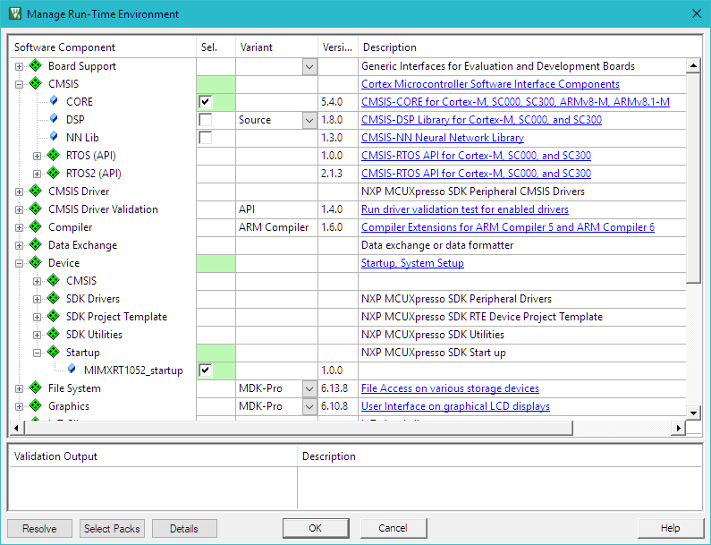
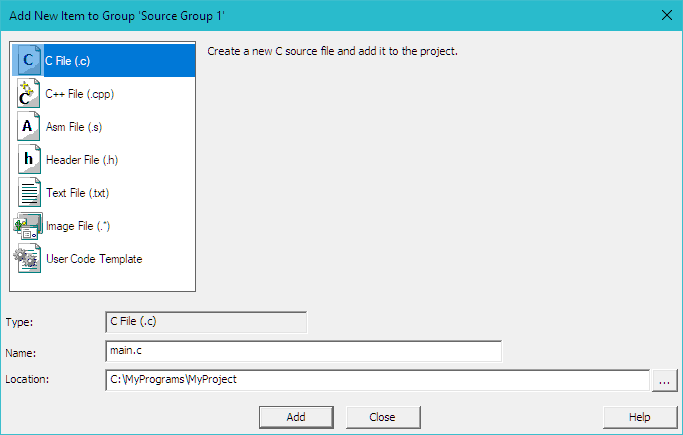
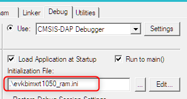
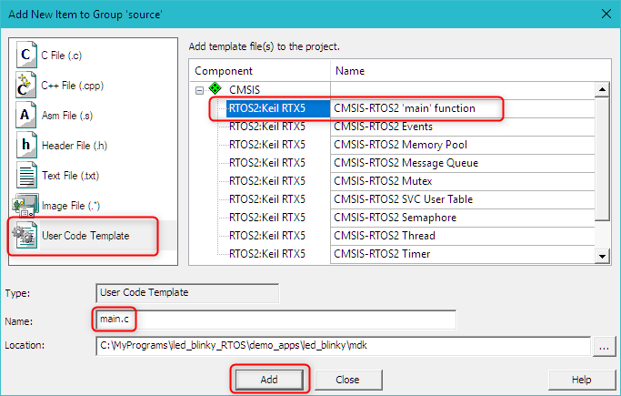
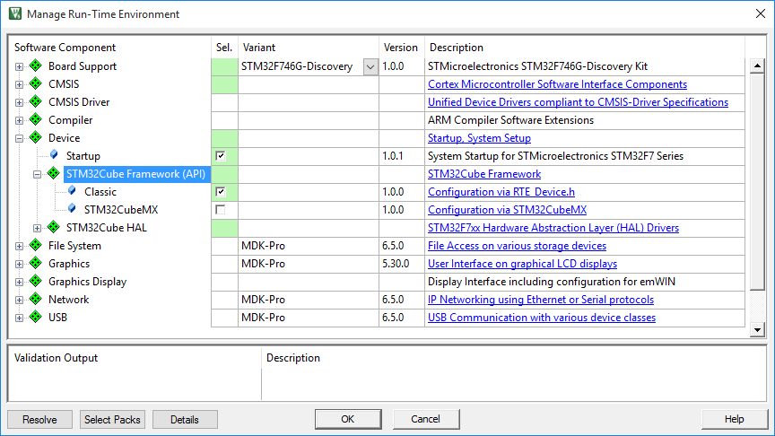
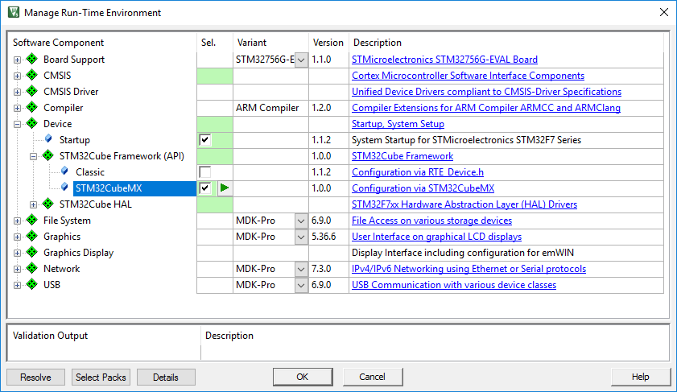
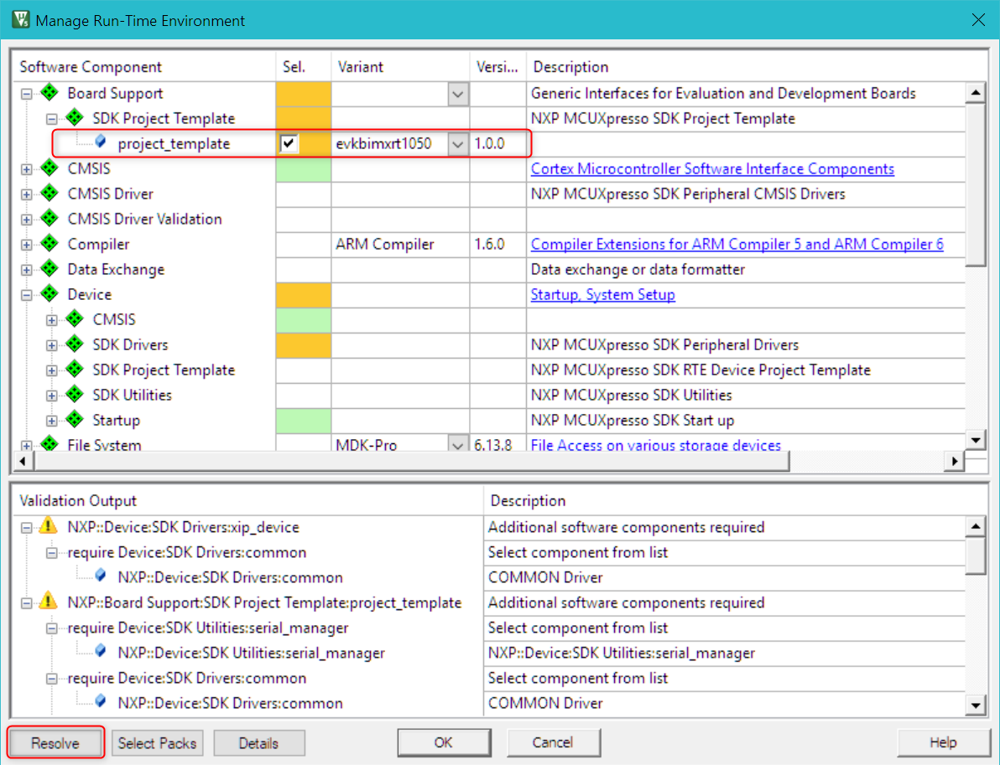
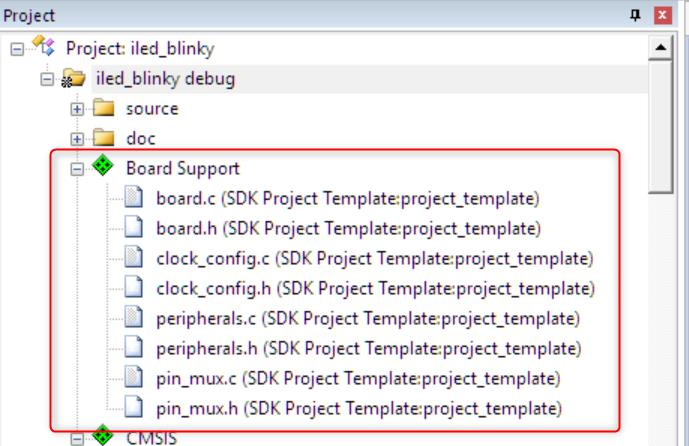
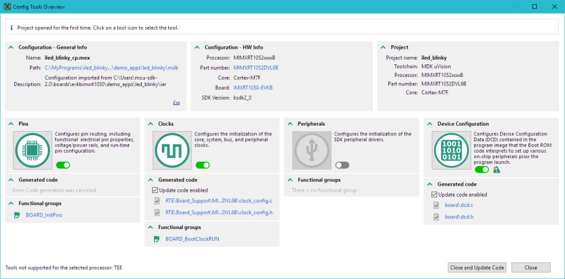

# 创作应用

本章将引导您完成使用前一章中描述的 **CMSIS** 组件创建项目所需的步骤。

对于许多流行的开发板，MDK已经提供了基于CMSIS的现成示例。始终建议以此类示例为起点，如 **使用示例项目验证安装** 中所解释的，然后根据自己的应用需求进行修改。

设备供应商也可能以MDK包安装程序中未索引的独立可交付项的形式提供MDK示例应用程序。设备供应商的开发和配置工具还可能允许将应用程序项目导出为Keil MDK格式。如果在MDK包安装程序中找不到示例，则应探索这两个选项。

本章结构如下：

- **从头开始的µVision项目** 部分解释了如何从头开始创建新项目，当没有可用的示例应用程序时可以遵循。

- **使用CMSIS-RTOS2的项目** 部分展示了如何轻松将具有无限循环设计的现有应用程序转换为使用CMSIS-RTOS2 API的实时操作系统。

- **设备配置变体** 解释了与设备供应商工具集成以进行设备启动的方法。

- 最后，**安全/非安全编程** 部分通过基于Armv8-M架构的设备的项目设置进行指南。

!!! 注意
    本章中的示例代码适用于MIMXRT1050-EVK评估板（搭载MIMXRT1052DVL6B设备）。请根据其他入门套件或开发板调整代码。

## 从头开始的µVision项目

本节描述了从头开始设置新的基于CMSIS的项目的步骤：

- **设置新µVision项目：** 创建一个项目文件，并选择微控制器设备以及相关的CMSIS组件。

- **添加*main.c*源代码文件：** 向项目添加main.c文件，其中包含 *main()函数* 和 *设备初始化* 的初始代码。

- **配置项目选项：** 调整项目设置以确保项目可以正确构建。

- **构建应用程序项目：** 编译和链接应用程序，以将其烧录到目标微控制器设备上。

- **使用调试器：** 引导您完成将评估板连接到PC并将应用程序下载到目标设备的步骤。

### 设置新µVision项目

从µVision菜单栏中选择 **Project – New µVision Project** 。

接下来，打开 **Select Device for Target** 对话框。


选择目标设备，并在多核设备中必要时选择目标CPU。在我们的案例中，选择的是MIMXRT1052DVL6B，然后点击 **OK** 。

!!! 提示
    如果目标设备未显示在列表中，请验证相应的设备系列包（DFP）是否已安装，如 **安装软件包** 中所解释的。

设备选择定义了基本的工具设置，如编译器控制、链接器的内存布局和Flash编程算法。然而，在某些情况下（尤其是对于更复杂的设备），需要进行其他配置以实现正确的项目构建和调试。这在步骤 **配置项目选项** 中进行了解释。

然后，**Manage Run-Time Environment** 对话框将打开，并显示已安装并适用于所选设备的软件组件。以下组件需要添加到基于CMSIS的项目中：

展开 **::CMSIS** 并启用 **CORE** 。

展开 **::Device::Startup** 并启用所提供的一个变体。在我们的案例中只有一个 **：MIMXRT1052_startup**。



根据应用程序的需要，可以添加其他组件。在我们的案例中，我们限制了最少的组件。
**Validation Output** 字段可能显示对基于当前选择的其他软件组件的依赖关系。在这种情况下，点击Resolve按钮以自动解析所有依赖关系并启用其他所需的组件。

!!! 提示
    单击消息会突出显示相关的软件组件。在我们上面的示例中，没有额外的依赖关系需要解决。

点击OK。

所选的软件组件与设备启动文件和CMSIS系统文件一起包含到项目中。项目窗口显示了所选的软件组件以及相关的文件。双击文件以在编辑器中打开它。


### 添加*main.c*源代码文件

现在我们可以添加带有初始程序代码的main.c文件。

在项目窗口中，右键单击Source Group 1并打开 **Add New Item to Group** 对话框。

单击C File (.c)指定文件名，在我们的案例中为main.c，然后点击Add。



这将在项目组Source Group 1中创建main.c文件。向文件中添加以下内容：

```c
/* ------------------------------------------------------------------
 * main.c file
 * ----------------------------------------------------------------*/
#include "RTE_Components.h"  // Component selection
#include CMSIS_device_header // Device header
uint32_t volatile msTicks;   // Counter for millisecond Interval
void SysTick_Handler(void)
{              // SysTick Interrupt Handler
    msTicks++; // Increment Counter
}
void WaitForTick(void)
{
    uint32_t curTicks;
    curTicks = msTicks; // Save Current SysTick Value
    while (msTicks == curTicks)
    {            // Wait for next SysTick Interrupt
        __WFE(); // Power-Down until next Event
    }
}
// Configure & Initialize the MCU
void Device_Initialization(void)
{
    SystemInit();            // Device initialization
    SystemCoreClockUpdate(); // Clock setup
    if (SysTick_Config(SystemCoreClock / 1000))
    {     // SysTick 1ms
        ; // Handle Error
    }
}
// The processor clock is initialized by CMSIS startup + system file
int main(void)
{                            // User application starts here
    Device_Initialization(); // Configure & Initialize MCU
    while (1)
    {                    // Endless Loop (the Super-Loop)
        __disable_irq(); // Disable all interrupts
        // Get_InputValues ();
        __enable_irq(); // Enable all interrupts
        // Process_Values ();
        WaitForTick(); // Synchronize to SysTick Timer
    }
}
```
对于许多设备，按照步骤 **构建应用程序项目** 中描述的构建过程在这一步骤之后就会成功。 在某些情况下（例如我们的MIMXRT1052示例），项目配置中可能需要进行其他更改，如下面的 **配置项目选项** 部分所解释。

#### 设备初始化

在我们的简单示例中，系统初始化是在 ***Device_initialization()*** 函数中使用仅CMSIS-Core API完成的。

芯片供应商提供了特定于设备的文件system_<device>.c（在我们的案例中是system_MIMXRT2052.c），该文件实现了SystemInit和SystemCoreClockUpdate函数。 通过在前一步中在Manage Run-Time Environment中选择 **::Device::Startup** 组件，此文件将自动添加到项目中。

实际示例通常需要对引脚和外设进行复杂的配置，系统设置的重要部分依赖于供应商提供的设备 **硬件抽象层（HAL）** 。

**设备配置变体** 部分解释了更多详细信息，并提供了使用外部工具进行设备配置的示例。

### 配置项目选项

对于某些设备，使用默认设置无法构建新项目并将其编程到设备上，因此需要特殊的配置选项。这通常是选择以现成示例开始的原因。

单击工具栏上的 **Options for Target...** 按钮以访问配置选项。

它包含多个选项卡，为相应的功能提供配置选项。


入门所需的更改取决于目标设备和项目中使用的软件组件。下面的小节解释了在我们的示例中使用的MIMXRT1052的指定对话框选项的修改要求。

#### C/C++ (AC6) 对话框

为了排除由Arm Compiler 6生成的大部分仅具有信息性的警告，请在C/C++ (AC6)选项卡的Warnings字段中选择AC5-like Warnings。

#### 链接器对话框

复杂的设备或程序可能需要使用scatter文件指定内存布局。下图突出显示了我们示例中所需的更改：


1. 取消选中“使用目标对话框中的内存布局”选项，以启用在项目中提供的自定义scatter文件。

2. R/O和R/W Bases分别定义只读（代码和常量）和读写区域的起始地址。

3. 禁用未使用内存对象的警告＃6314。

4. 设备系列包（DFP）包含一些预配置的scatter文件，这些文件将复制到新项目中。为了简化项目配置，我们将从片上RAM中执行程序，因此在Scatter文件的下拉菜单中选择.\RTE\Device\MIMXRT1052DVL6B\MIMXRT1052xxxxx_ram.scf。

#### 调试对话框

为确保程序加载到RAM并且我们可以对其进行调试，在调试选项卡中需要进行以下更改。



在项目文件夹中创建一个新文件，该文件将用于初始化调试会话（在我们的案例中为evkbim

```c
/*-------------------------------------------------------------------
* evkbimxrt1050_ram.ini file
*------------------------------------------------------------------*/
FUNC void Setup (void) {
 SP = _RDWORD(0x00000000); // Setup Stack Pointer
 PC = _RDWORD(0x00000004); // Setup Program Counter
 _WDWORD(0xE000ED08, 0x00000000); // Setup VTOR
}
FUNC void OnResetExec (void) { // executes upon software RESET
Setup(); // Setup for Running
}
LOAD %L INCREMENTAL // Download
Setup(); // Setup for Running
// g, main
```

#### 实用程序对话框
在实用程序对话框中，取消选中选项 **在调试之前更新目标** ，以确保调试器不尝试将程序加载到Flash。


### 构建应用程序项目

使用“Rebuild”工具栏按钮构建应用程序，该按钮将编译和链接所有相关的源文件。 构建输出显示有关构建过程的信息。 无错误构建将显示程序大小信息，零错误和零警告。

**调试应用程序** 部分将引导您完成将评估板连接到PC并将应用程序下载到目标硬件的步骤。

## 使用CMSIS-RTOS2的项目

本节展示如何设置基于CMSIS-RTOS2的简单项目。该项目使用设备HAL来控制板载LED。为了避免从头开始进行项目配置和设备初始化，我们采用了DFP附带的具有无限循环设计的现有blinky示例，并对其进行修改以基于CMSIS-RTOS2 API运行。需要执行以下步骤：

1. 复制示例：复制现有示例并验证其是否正常工作。
2. 添加CMSIS-RTO2组件：添加CMSIS-RTOS2 API和RTX5内核。
3. 添加RTOS初始化：添加初始化设备和RTOS的main.c文件。
4. 配置Keil RTX5 RTOS：根据应用程序需求修改RTOS设置。
5. 实现用户线程：实现用户代码。
6. 构建并运行程序：步骤与前一节中解释的相同。

在我们的示例中，我们将使用IMXRT1050-EVK板的简单iled_blinky示例。

### 复制示例


**使用示例项目验证安装** 部分解释了复制、构建和运行示例项目所需的步骤。在我们的示例中，我们使用了目标iled_blinky debug，该目标在片上RAM中执行程序。

要构建带有iled_blinky debug目标的项目，必须从构建中排除与SPI flash相关的文件 *fsl_flexspi_nor_boot.c* 。

在 **Project** 窗口的 **Device** 组件下找到此文件，右键单击它，然后选择 **Options for Component Class ‘Device’** ，在 **Properties** 选项卡中取消选中 **Include in target build** 。按 **OK** 。该文件将带有相应的符号标记。

### 添加CMSIS-RTOS2组件

接下来，添加RTOS软件组件：

展开 **::CMSIS::RTOS2 (API)** 并启用 **Keil RTX5** 。在 **Variant** 列中选择 **Source** ，以将RTOS添加到项目作为支持使用Event Recorder进行详细调试的源代码。要减小代码大小，请改用 **Library** 变体。按 **OK** 。


Keil RTX5代码出现在项目窗口中，位于CMSIS组件下。

在我们的案例中，对于MIMRT1052，我们需要更改 **Assembler Option** ，以便可以正确汇编Keil RTX5文件 **irq4_cm4f.s** 。

为此，请转到 **Options for Target.. – Asm** 选项卡，并在下拉菜单 **Assembler Option** 中选择 **armclang (Auto Select)** ，而不是默认情况下配置的 **armclang (GNU Syntax)** 。按 **OK** 。

或者，可以仅为irq4_cm4f.s文件指定汇编器选项。为此，在 **Project** 窗口中的 **CMSIS** 组件下找到此文件，右键单击它，然后选择 **Options for Component Class ‘CMSIS’** ，在 **Asm** 选项卡中在 **Assembler Option** 字段的下拉菜单中选择 **armclang (Arm Syntax)** 。按OK。

### 添加RTOS初始化

使用预配置的 **User Code Templates** 添加模板应用程序代码，其中包含类似于软件组件功能的例程。

在项目窗口中，在包含源代码的组中右键单击（在我们的案例中为source），然后打开 **Add New Item to Group** 对话框。

单击 **User Code Template** 以列出项目中包含的软件组件的可用代码模板。选择 **CMSIS-RTOS2 ‘main’ function** ，验证文件名，然后单击 **Add** 。



单击 **User Code Template** 以列出项目中包含的软件组件的可用代码模板。选择 **CMSIS-RTOS2 ‘main’ function** ，验证文件名，然后单击 **Add** 。

我们重用了原始main()函数中的设备初始化功能。我们删除了app_main函数的实现，因为它将放在另一个文件中。结果，main.c文件包含以下代码：

```c
/*-------------------------------------------------------------------
 * CMSIS-RTOS 'main' function template
 *------------------------------------------------------------------*/
#include "RTE_Components.h"
#include CMSIS_device_header
#include "cmsis_os2.h"
#include "board.h"
#include "pin_mux.h"
extern void app_main(void *argument); // application main thread
int main(void)
{
    /* Board pin init */
    BOARD_InitPins();
    BOARD_InitBootClocks();
    // System Initialization
    SystemCoreClockUpdate();
    // ...
    osKernelInitialize();              // Initialize CMSIS-RTOS
    osThreadNew(app_main, NULL, NULL); // Create application main thread
    osKernelStart();                   // Start thread execution
    for (;;)
    {
    }
}
```
请注意 ***Board_InitPins()*** 和 ***Board_InitBootClocks()*** 函数，它们配置底层的MIMXRT1052设备。 **示例：MCUXpresso配置工具** 部分更详细地解释了设备配置。

### 配置Keil RTX5 RTOS

在Project窗口的CMSIS组中打开RTX_Config.h文件，并根据项目需求进行配置，如 **Keil RTX5配置** 中所解释的。在我们的示例中，我们可以保持默认设置。

### 实现用户线程

现在可以使用RTOS线程重写包含初始main()函数的led_blinky.c文件。我们实现了两个用户线程：*thrLED*切换LED和*thrSGN*充当信号线程，以定期延迟触发thrLED线程。

```c
#include "RTE_Components.h"
#include CMSIS_device_header
#include "cmsis_os2.h"
#include "board.h"

void thrLED(void *argument) {
    while (1) {
        // Toggle LED
        Board_LED_Toggle(0);
        osDelay(500);  // Delay 500ms
    }
}

void thrSGN(void *argument) {
    while (1) {
        // Signal thrLED to execute with a delay
        osSignalSet(thrLED_ID, 0x01);
        osDelay(1000);  // Delay 1000ms
    }
}

int main(void) {
    // Initialize the board
    Board_InitPins();
    Board_InitBootClocks();

    // Initialize CMSIS-RTOS
    osKernelInitialize();

    // Create user threads
    osThreadNew(thrLED, NULL, NULL);
    osThreadNew(thrSGN, NULL, NULL);

    // Start CMSIS-RTOS
    osKernelStart();

    // We should never get here as control is now taken by the RTOS
    while (1) {
    }
}
```

## 设备配置变化

CMSIS-CORE定义了设备启动的方法，例如 *SystemInit()* 和 *SystemClock_Config()* ，但实际的实现细节在不同厂商之间有所不同。

一些设备作为设备 **硬件抽象层（HAL）** 的一部分执行了系统设置的重要部分。在许多情况下，针对目标平台的HAL组件作为 **设备系列包（DFP）** 的一部分提供，并且可以在Manage Run-Time Environment对话框中选择，通常在 **::Device component** 下。

设备厂商经常提供一个软件框架，允许使用外部实用程序进行设备配置。

在下面的部分中，将举例说明设备启动的变化。

### 示例：STM32Cube
许多 **STM32设备** 使用 **STM32Cube框架** ，可以通过（1）使用 **RTE_Device.h** 配置文件的传统方法或（2）使用 **STM32CubeMX** 工具进行配置。

经典的 **STM32Cube框架** 组件提供了一个特定的 **用户代码模板** ，用于实现系统设置。使用STM32CubeMX，main.c文件和启动所需的其他源文件将被复制到项目中 **STM32CubeMX:Common Sources** 组的下方。

#### 使用传统框架设置项目

此示例使用传统方法为 **STM32F746G-Discovery套件** 创建一个项目。在Manage Run-Time Environment窗口中，选择以下内容：

展开 **::Device:STM32Cube Framework (API)** 并启用 **:Classic** 。
展开 **::Device** 并启用 **:Startup** 。



单击 **Resolve** 以启用其他所需的软件组件，然后单击 **OK** 。

在Project窗口中，右键单击Source Group 1并打开Add New Item to Group对话框。


单击 **User Code Template** 以列出项目中包含的软件组件的可用代码模板。选择 **‘main’ module for STM32Cube** 并单击 **Add** 。

main.c文件包含 *SystemClock_Config()* 函数。在这里，您需要进行时钟设置的设置：

main.c的代码
```c
static void SystemClock_Config (void)
{
    RCC_ClkInitTypeDef RCC_ClkInitStruct;
    RCC_OscInitTypeDef RCC_OscInitStruct;
    /* Enable HSE Oscillator and activate PLL with HSE as source */
    RCC_OscInitStruct.OscillatorType = RCC_OSCILLATORTYPE_HSE;
    RCC_OscInitStruct.HSEState = RCC_HSE_ON;
    RCC_OscInitStruct.HSIState = RCC_HSI_OFF;
    RCC_OscInitStruct.PLL.PLLState = RCC_PLL_ON;
    RCC_OscInitStruct.PLL.PLLSource = RCC_PLLSOURCE_HSE;
    RCC_OscInitStruct.PLL.PLLM = 25;
    RCC_OscInitStruct.PLL.PLLN = 432;
    RCC_OscInitStruct.PLL.PLLP = RCC_PLLP_DIV2;
    RCC_OscInitStruct.PLL.PLLQ = 9;
    HAL_RCC_OscConfig(&RCC_OscInitStruct);
    /* Activate the OverDrive to reach the 216 MHz Frequency */
    HAL_PWREx_EnableOverDrive();
    /* Select PLL as system clock source and configure the HCLK, PCLK1 and
   PCLK2 clocks dividers */
    RCC_ClkInitStruct.ClockType = (RCC_CLOCKTYPE_SYSCLK | RCC_CLOCKTYPE_HCLK | RCC_CLOCKTYPE_PCLK1 | RCC_CLOCKTYPE_PCLK2);
    RCC_ClkInitStruct.SYSCLKSource = RCC_SYSCLKSOURCE_PLLCLK;
    RCC_ClkInitStruct.AHBCLKDivider = RCC_SYSCLK_DIV1;
    RCC_ClkInitStruct.APB1CLKDivider = RCC_HCLK_DIV4;
    RCC_ClkInitStruct.APB2CLKDivider = RCC_HCLK_DIV2;
    HAL_RCC_ClockConfig(&RCC_ClkInitStruct, FLASH_LATENCY_7);
}
```

现在，您可以开始使用这个模板编写您的应用程序代码。

#### 使用STM32CubeMX设置项目

此示例使用STM32CubeMX创建与之前相同的项目。在Manage Run-Time Environment窗口中，选择以下内容：

展开 **::Device:STM32Cube Framework (API)** 并启用 **:STM32CubeMX** 。展开 **::Device** 并启用 **:Startup** 。



单击 **Resolve** 以启用其他所需的软件组件，然后单击 **OK** 。一个新窗口将要求您启动 **STM32CubeMX** 。


STM32CubeMX以正确的设备启动：


根据需要配置您的设备。完成后，转到 **Project → Generate Code** 以创建一个GPDSC文件。µVision将通知您：


单击 **Yes** 以导入项目。 **main.c** 和 **其他生成的文件** 将添加到一个名为 **STM32CubeMX:Common Sources** 的文件夹中。

有关使用STM32CubeMX在µVision项目中进行设备设置的详细文档，请阅读专门的文档 keil.com/pack/doc/STM32Cube/General/html/index.html。

### 示例：MCUXpresso Config Tools

对于配置其大多数Kinetis、LPC和iMX RT设备，NXP提供 **MCUXpresso Config Tools** 。

#### 启用配置工具的项目
要为MCUXpresso Config Tools配置MDK项目，它必须包含在Board Support和Device组中的特殊组件。对于通过Pack Installer可用的许多示例项目，已经是这种情况，但对于旧项目或从头开始创建项目时，需要确保这一点。

展开 **::Board Support::SDK Project Template::** 并启用 **:project_template**。在 **Variant** 列的下拉菜单中选择 **目标MCU** 或（如果可用）**目标板**（在我们的例子中是evkbimxrt1050）。可能需要突出显示多个依赖项，这是必需的。



单击 **Resolve** 以启用所需的软件组件，然后单击 **OK** 。



#### 配置设备

当项目包含上面子部分中解释的组件时，可以使用MCUXpresso Config Tools创建设备初始化代码。

启动MCUXpresso Config Tools。**Create a new configuration dialog opens** 。该对话框也可以从 **File – New…** 菜单中打开。

选择 **Create a new configuration based on an existing IDE/toolchain project** 选项，并指定µVision项目的路径。在我们的例子中，我们采用在 **CMSIS-RTOS2** 部分中解释的示例。

按下Finish。


等待Config Tool Overview窗口打开。

使用可用的图形工具根据需要配置设备时钟、引脚、外设和DCD。



在我们的例子中，我们添加了一个GPIO5初始化，用于板上的用户按钮：


按下Update Code按钮。查看要应用的更改，然后按OK。


这将更新项目中的Board Support组中的必要文件。

#### 根据设备更新应用代码

根据新的设备配置更新应用代码。

这可能需要包含一些头文件，在main()中调用额外的初始化函数，当然还要实现应用程序逻辑本身。

在我们的示例中，我们只需更新led_blinky.c文件中的thrSGN线程，以便在按下用户按钮时推迟切换LED的信号

```c
/*-----------------------------------------------------------------
 thrSGN: Signal LED to change 
*----------------------------------------------------------------*/
__NO_RETURN static void thrSGN(void *argument)
{
    (void)argument;
    uint32_t last;
    for (;;)
    {
        osDelay(500U); // Run delay for 500 ticks
        while (!GPIO_PinRead(BOARD_USER_BUTTON_GPIO,
                             BOARD_USER_BUTTON_GPIO_PIN))
        {
            osDelay(10); // Delay further while SW8 button is pressed
        }
        osThreadFlagsSet(tid_thrLED, 1U); // Set flag to thrLED
    }
}
```
## Secure/non-secure编程

嵌入式系统程序员面临的产品要求包括成本敏感的硬件、确定性实时行为、低功耗操作和安全资产保护。
现代应用对安全性有强烈需求。可能需要保护的资产包括：

- 设备通信（使用加密和身份验证方法）
- 机密数据（如密钥和个人信息）
- 固件（防止知识产权盗窃和逆向工程）
- 运营（以维护服务和收入）

TrustZone® for Armv8-M安全扩展是一种针对超低功耗嵌入式应用进行优化的SoC和CPU系统范围的安全方法。它实现了限制对安全内存和I/O的访问仅限于受信任软件的多个软件安全域。
TrustZone for Armv8-M架构（Cortex-M23/M33/M35P/M55内核）：

- 保持对安全和非安全域的低中断延迟。

- 不会引入代码或周期开销。

- 引入对调用安全域的有效指令。

### 创建Armv8-M软件项目

在MDK中为Armv8-M内核（Cortex-M23/M33/M35P/M55）创建新软件项目的步骤为：
- 定义整体系统和内存配置。这会影响：
    - 设置安全和非安全项目
    - 为安全和非安全项目添加启动代码和'main'模块。
    - 在CMSIS-Core文件partition_<device>.h中反映此配置。
- 在头文件中定义安全软件部分的API，以允许非安全部分使用
- 为安全和非安全部分创建应用软件
Application note 291详细描述了这些步骤，并包含使用Armv8-M目标进行安全和非安全编程的示例项目和最佳实践。可以在keil.com/appnotes/docs/apnt_291.asp找到。


