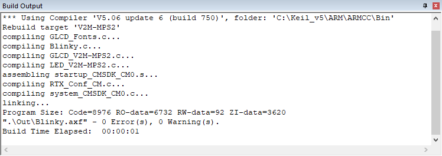

# ARM 微控制器开发工具包 (MDK) 介绍

MDK帮助您为超过7500种基于Arm Cortex-M处理器的设备创建嵌入式应用程序。MDK是一个强大而易于学习和使用的开发系统，由MDK-Core和软件包组成，可根据应用程序的要求进行下载和安装。

## MDK 工具
**MDK工具** 包括您创建、构建和调试基于Arm微控制器设备的嵌入式应用程序所需的所有组件。**MDK-Core** 包括 **Keil µVision IDE 和调试器**，对于基于Cortex-M处理器的微控制器设备提供了领先的支持。

MDK包括 **Arm C/C++ 编译器与汇编器**，**链接器**以及专为最佳代码大小和性能而定制的高度优化 **运行时库**。Arm编译器版本6基于创新的LLVM技术，支持包括C++11和C++14在内的最新C语言标准。它还提供了面向安全应用的TÜV认证套件，以及长期支持和维护。

## 软件包
软件包包含 **设备支持**、**CMSIS组件**、**中间件**、**板支持**、**代码模板** 和 **示例项目**。它们可以随时添加到MDK-Core，使得新的设备支持和中间件更新与工具链独立。µVision IDE管理了应用程序可用的提供的软件组件，这些组件可以作为构建块。

## MDK 版本
在[keil.com/editions](https://www.keil.com/)提供的产品选择器中，可以查看每个版本启用的功能的概述：

- MDK-Lite的代码大小受限于32KB，适用于产品评估、小型项目和教育市场。

- MDK-Essential支持所有基于Cortex-M处理器的微控制器，包括Cortex-M55。

- MDK-Plus添加了用于IPv4网络、USB设备、文件系统和图形的中间件库支持。它支持基于Arm Cortex-M、Arm Cortex-R4、ARM7和ARM9处理器的微控制器。

- MDK-Professional包含MDK-Plus的所有功能。此外，它支持IPv4/IPv6双栈网络和USB主机堆栈。它还提供对Arm编译器的安全合格版本的访问，以及所有必需的文档和证书。

## 许可类型
除了MDK-Lite外，所有MDK版本都需要使用许可代码进行激活。以下是可用的许可类型：

1. 单用户许可证 (节点锁定)授予一个开发人员在同时在两台计算机上使用产品的权利。

2. 浮动用户许可证或FlexNet许可证授予多个开发人员在同一时间在不同计算机上使用产品的权利。

有关详细信息，请参阅[许可证用户指南](keil.com/support/man/docs/license)。

## 安装

### 软件和硬件要求
MDK具有以下最低硬件和软件要求：
- 运行当前 Microsoft Windows 桌面操作系统（32位或64位）的计算机
- 4 GB RAM 和 8 GB 硬盘空间
- 1280 x 800 或更高分辨率的屏幕；鼠标或其他指针设备
确切的要求可在[keil.com/system-requirements/](keil.com/system-requirements/)找到。

### 安装MDK
从[keil.com/demo/eval/arm.htm](https://www.keil.com/demo/eval/arm.htm)下载MDK并运行安装程序。
按照说明在本地计算机上安装MDK。安装还会自动添加用于Arm CMSIS、Arm编译器和MDK-Middleware的软件包。
MDK安装完成后，Pack Installer将自动启动，允许您添加补充的软件包。至少，您需要安装支持目标微控制器设备的软件包。

!!! 注意
    MDK版本5可以在从[keil.com/mdk5/legacy](https://www.keil.com/mdk5/legacy)安装**遗留支持**之后使用MDK版本4项目。这增加了对基于Arm7、Arm9和Cortex-R处理器的设备的支持。

- [ ] 尝试

### 安装软件包
Pack Installer在本地计算机上管理软件包。软件包存储在包根文件夹中（默认为 %localappdata%\Arm\Packs）。

Pack Installer在安装过程中会自动运行，但也可以从µVision中使用菜单项 Project – Manage – Pack Installer 运行。要访问设备和示例项目，安装与您的目标设备或评估板相关的软件包。

!!! 注意
    要获取已发布软件包的信息，Pack Installer连接到[keil.com/pack](https://keil.com/pack)。

Pack Installer底部的状态栏显示有关互联网连接和安装进度的信息。

!!! 提示
    设备数据库列出了所有支持的设备，并提供与相关软件包的下载访问。可在[https://developer.arm.com/embedded/cmsis/cmsis-packs/devices](https://developer.arm.com/embedded/cmsis/cmsis-packs/devices)找到。如果Pack Installer没有互联网访问权限，您可以通过使用菜单命令 File – Import 或双击 *.PACK 文件手动安装软件包。

#### 管理本地存储库
在开发软件包时，可以通过在每次修改后而不需要重新构建和重新安装软件包的情况下，快速验证它在µVision项目中的工作，为此，应将包内容的文件夹添加到受管本地存储库列表中。使用Pack Installer菜单 File - Manage Local Repositories...，点击 Add...，选择软件包文件夹中的PDSC文件，然后点击 OK：

为确保在项目中应用对软件包的更改，使用µVision菜单 Project - Manage - Reload Software Packs 重新加载软件包。

### MDK-Professional 试用许可证
MDK具有内置的功能，用于请求MDK-Professional的30天试用许可证。这将取消代码大小限制，您可以探索和测试全面的中间件。
以管理员权限启动µVision。

在µVision中，转到 File – License Management... 并点击 Evaluate MDK Professional

一个窗口将打开，显示提交到Arm Keil服务器以生成个人许可密钥的数据。

点击确定后，浏览器将打开，您将被导向到一个注册页面。通过点击提交按钮确认信息是否正确。

完成后，您将从Keil web服务器收到一封带有评估许可证号的电子邮件。
在µVision的 License Management 对话框中，输入新许可证ID代码（LIC）字段的值，然后点击 Add LIC：

现在您可以使用MDK-Professional进行30天。

### 使用示例项目验证安装
一旦您已经选择、下载并安装了适用于您的设备的软件包，您可以使用软件包中提供的示例之一验证您的安装。为了验证软件包的安装，我们建议使用一个 Blinky 示例，它通常会在目标板上闪烁LED。

!!! 提示
    请在 [keil.com/mdk5/install](https://www.keil.com/mdk5/install) 上查看入门视频，该视频解释了如何连接并使用评估套件。

#### 复制示例项目
在 Pack Installer 中，选择 Examples 选项卡。使用工具栏中的搜索字段缩小示例列表。

点击 Copy 并输入您的工作目录的目标文件夹名称。

!!! 注意
    您必须将示例项目复制到您选择的工作目录。

- 启用 Launch µVision 以直接在IDE中打开示例项目。
- 启用 Use Pack Folder Structure 以将示例项目复制到共同文件夹中。这可以避免覆盖来自其他示例项目的文件。禁用 Use Pack Folder Structure 以减少示例路径的复杂性。
- 点击 OK 启动复制过程。

#### 在µVision中使用示例应用程序
µVision启动并加载示例项目，您可以：

- 构建应用程序，它会编译和链接相关的源文件。
- 下载应用程序，通常到设备的片上Flash ROM。
- 使用调试器在目标硬件上运行应用程序。

逐步说明向您展示如何执行这些任务。复制示例后，µVision启动并看起来像下面的图片。

!!! 提示
    大多数示例项目包含一个包含有关操作和硬件配置的关键信息的 Abstract.txt 文件。

#### 构建应用程序

使用工具栏上的 Rebuild 按钮构建应用程序。

Build Output 窗口显示有关构建过程的信息。一个无错误的构建会显示关于程序大小的信息。

#### 下载应用程序

使用通过USB连接的调试适配器将目标硬件连接到计算机。多个评估板提供了
一个内置的调试适配器。

现在，检查调试适配器的设置。通常，示例项目已经为评估套件预配置，因此您无需修改这些设置。

点击工具栏上的 Options for Target 并选择 Debug 选项卡。验证所选的和启用的是您正在使用的评估板的正确调试适配器。例如，CMSIS-DAP Debugger 是各种入门套件的常见内置调试适配器。

启用在启动时 Load Application 以在µVision调试器中加载应用程序，每次启动调试会话时。

启用 Run to main() 以执行到 main() 函数的第一条可执行语句。每次重置时都会执行这些指令。

!!! 提示
    点击 Settings 按钮以验证通信设置并诊断与目标硬件的问题。有关详细信息，请在对话框中点击 Help 按钮。如果遇到任何问题，请参阅入门套件的用户指南。

点击工具栏上的 Download 以将应用程序加载到目标硬件。

Build Output 窗口显示有关下载进度的信息。

#### 运行应用程序
点击工具栏上的 Start/Stop Debug Session 以在硬件上开始调试应用程序。

点击 Debug 工具栏上的 Run 以开始执行应用程序。LED应该在目标硬件上闪烁。

## 访问文档
MDK提供在线手册和上下文相关的帮助。µVision **Help** 菜单打开包括 *µVision User’s Guide*、入门手册、编译器、链接器和汇编器参考指南在内的主要帮助系统。

许多对话框都有上下文相关的 **Help** 按钮，用于访问文档并解释对话框选项和设置。

在编辑器中按 **F1** 键可访问有关语言元素的帮助，如RTOS函数、编译器指令或库例程。在 **Output** 窗口的命令行中使用 **F1** 键，可以获取有关调试命令、错误和警告消息的帮助。

**Books** 窗口可能包括设备参考指南、数据表或板手册。您甚至可以通过菜单 **Project – Manage – Components, Environment, Books – Books** 在 **Books** 窗口中添加自己的文档并启用它。

**Manage Run-Time Environment** 对话框通过 *Description* 列中的链接提供对文档的访问。

在 **Project** 窗口中，右键单击软件组件组并打开相应元素的文档。

可在线访问 **µVision User’s Guide**: [keil.com/support/man/docs/uv4](https://www.keil.com/support/man/docs/uv4)。

## 请求协助
如果您有建议，或者在软件中发现了问题，请向我们报告。支持信息可以在 [keil.com/support](https://www.keil.com/support) 找到。
在报告问题时，请提供您的许可证代码（如果有的话）和µVision菜单 Help – About 中提供的产品版本。

## 在线学习

我们的 [keil.com/learn](https://www.keil.com/learn) 网站可以帮助您更多地了解基于Arm Cortex的微控制器的编程。它包含教程、进一步的文档以及指向其他网站的有用链接。

可在 [keil.com/video](https://www.keil.com/video) 上找到有关工具和软件开发不同方面的视频。

