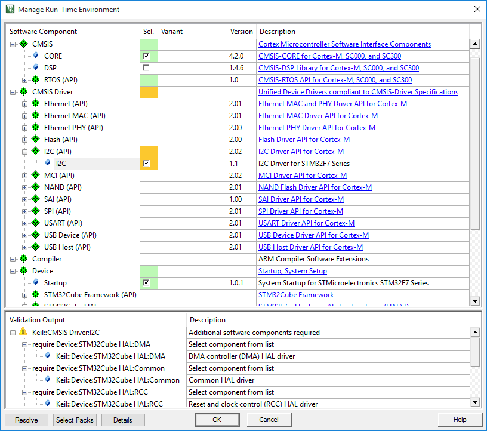
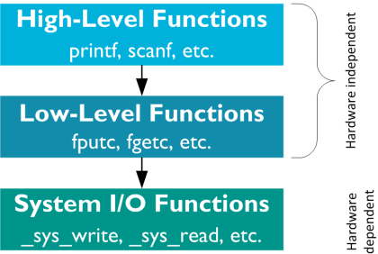
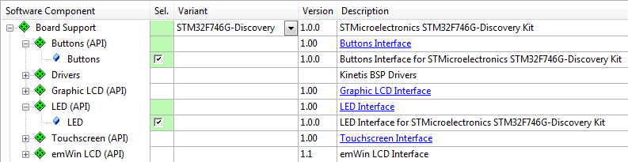

# Software Components

The development of complex embedded applications requires a modular architecture with multiple own and third-party components used. MDK and CMSIS allow to easily integrate and maintain software components in your projects.

## Use Software Packs

Software packs contain information about microcontroller devices and software components that are available for the application as building blocks.

The device information pre-configures development tools for you and shows only the options that are relevant for the selected device. 

- **Step 1:** Start µVision and use the menu Project - New µVision Project. After you have selected a project directory and specified the project name, select a target device.

!!! tip
    Only devices that are part of the installed software packs are shown. If you are missing a device, use the Pack Installer to add the related software pack. The search box helps you to narrow down the list of devices.

- **Step 2:** After selecting the device, the Manage Run-Time Environment window 
shows the related software components for this device.

!!! tip
    The links in the column Description provide access to the documentation of each software component.

!!! note
    The notation ::<Component Class>:<Group>:<Name> is used to refer to components. For example, ::CMSIS:CORE refers to the component CMSIS-CORE selected in the dialog above.

## Software Component Overview

The following table shows the software components included with a typical MDK installation. Depending on your MDK edition and selected device, some of these software components might not be available in the Manage Run-Time Environment window. In case you have installed additional software packs, more software components will be available.

## Product Lifecycle Management with Software Packs

MDK allows you to install **multiple versions of a software pack**. This enables product lifecycle management (PLM) as it is common for many projects.

- Concept: Definition of major project requirements and exploration with a 
functional prototype.

- Design: Prototype testing and implementation of the product based on the 
final technical features and requirements.

- Release: The product is manufactured and brought to market.
  
- Service: Maintenance of the products including support for customers; 
finally, phase-out or end-of-life.

In the concept and design phase, you normally want to use the latest software packs to be able to incorporate new features and bug fixes quickly. Before product release, you will freeze the software components to a known tested state. In the product service phase, use the fixed versions of the software components to support customers in the field.

The dialog Select Software Packs helps you to manage the versions of each software pack in your project:

When the project is completed, disable the option Use latest version of all installed Software Packs and specify the software packs with the settings under Selection:

- latest: use the latest version of a software pack. Software components are 
updated when a newer software pack version is installed.

- fixed: specify an installed version of the software pack. Software components 
in the project target will use these versions.

- excluded: no software components from this software pack are used.

## Software Version Control System (SVCS)

µVision carries template files for GIT, SVN, CVS, and others to support Software Version Control Systems (SVCS). 
Application note 279 “Using Git for Project Management with µVision” (keil.com/appnotes/docs/apnt_279.asp) describes how to establish a robust workflow for version control of projects using software packs.

## Compiler: Event Recorder

Modern microcontroller applications often contain middleware components, which are normally a "black box" to the application programmer. Even when comprehensive documentation and source code is provided, analyzing of potential issues is challenging.

The software component **Compiler:Event Recorder** uses event annotations in the application code or software component libraries to provide event timing and data information while the program is executing. This event information is stored in an event buffer on the target system that is continuously read by the debug unit and displayed in the event recorder window of the µVision debugger.

During program execution, the µVision debugger reads the content of the event buffer using a debug adapter that is connected via **JTAG** or **SWD** to the CoreSight **Debug Access Port (DAP)**. The event recorder requires no trace hardware and can therefore be used on any Cortex-M processor-based device.

To display the data stored in the event buffer in a human readable way, you need to create a Software Component Viewer Description (SCVD) file. Refer to: keil.com/pack/doc/compiler/EventRecorder/html/index.html 
The section **Event Recorder** on page 74 shows how to use the event recorder in a 
debug session.

## Compiler:I/O

The software component **Compiler:I/O** allows you to retarget I/O functions of the standard C run-time library. Application code frequently uses standard I/O library functions, such as *printf()*, *scanf()*, or *fgetc()* to perform input/output operations.

The structure of these functions in the standard Arm Compiler C run-time library is:

The high-level and low-level functions are not target-dependent and use the system I/O functions to interface with hardware.

The MicroLib of the Arm Compiler C run-time library interfaces with the hardware via low-level functions. The MicroLib implements a reduced set of high-level functions and therefore does not implement system I/O functions.

The software component Compiler:I/O retargets the I/O functions for the various standard I/O channels: File, STDERR, STDIN, STDOUT, and TTY:

The variant selection allows you to change the hardware interface of the I/O channel.

The software component **Compiler** adds the file *retarget_io.c* that will be configured according to the variant settings. For the **User** variant, user code templates are available that help you to implement your own functionality. Refer to the documentation for more information.

ITM in the Cortex-M3/M4/M7 supports printf style debugging. If you choose the variant ITM, the I/O library functions perform I/O operations via the Debug (printf) Viewer window.

As ITM is not available in Cortex-M0/M0+ devices, you can use the event recorder to display printf debug messages. Use the EVR variant of the STDOUT I/O channel for this purpose (works with all Cortex-M based devices).

For more details refer to: 
keil.com/pack/doc/compiler/RetargetIO/html/index.html

## Board Support

There are a couple of interfaces that are frequently used on development boards, such as LEDs, push buttons, joysticks, A/D and D/A converters, LCDs, and touchscreens as well as external sensors such as thermometers, accelerometers, magnetometers, and gyroscopes.

The **Board Support Interface API** provides standardized access to these interfaces. This enables software developers to concentrate on their application code instead of checking device manuals for register settings to toggle a GPIO. Many Device Family Packs (DFPs) have board support included. You can choose board support from the Manage Run-Time Environment window:

Be sure to select the correct Variant to enable the correct pin configurations for your development board.

You can add board support to your custom board by creating the required support files for your board’s software pack. Refer to the API documentation available at: keil.com/pack/doc/mw/Board/html/index.html

## IoT Clients

A set of MDK-Packs provides building blocks that enable secure connection from a device to a cloud provider of choice.

**MDK-Middleware Network Component**, **lwIP** and various WiFi modules (through CMSIS WiFi-Driver) are supported as underlying **network stacks**. 

Reference **Socket (API)** implementations are provided in the **MDK::IoT_Socket** pack. **mbed TLS** contains required components to secure the connection. Finally, communication with a cloud service is enabled with **IoT Clients** available for the following providers:

- Amazon AWS IoT
- Google Cloud IoT 
- IBM Watson IoT
- Microsoft Azure IoT Hub 
- Paho MQTT (Eclipse)

The software packs are generic (device-independent) and can be found in the 
Pack Installer.

Additional information is provided at: keil.com/iot.