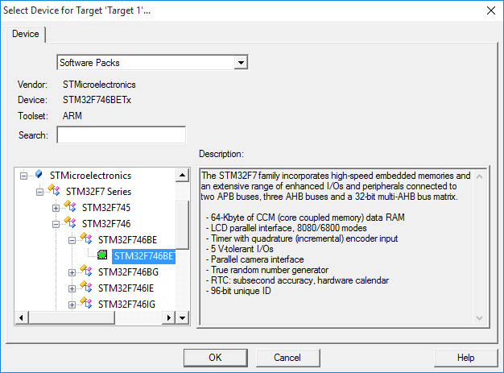
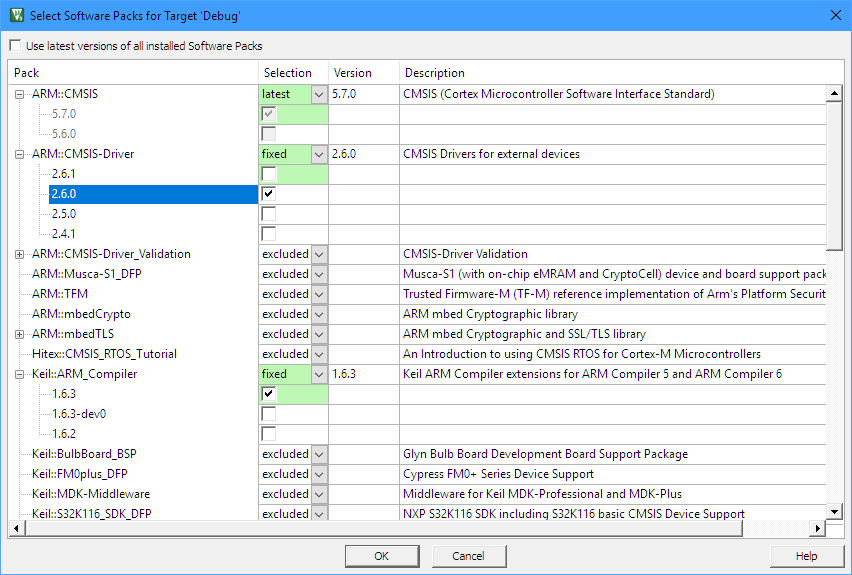
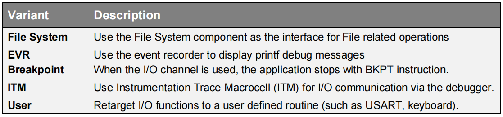
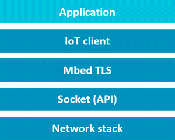
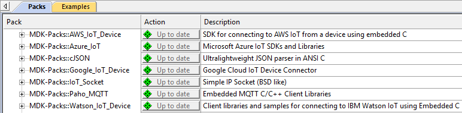

# 软件组件

在开发复杂的嵌入式应用程序时，需要采用模块化的架构，使用多个自有和第三方组件。MDK和CMSIS允许在项目中轻松集成和维护软件组件。

## 使用软件包（Software Packs）

软件包包含有关微控制器设备和可用于应用程序的软件组件的信息，这些组件可以作为构建块使用。

设备信息为您预配置了开发工具，并仅显示对所选设备相关的选项。

- **步骤 1：** 启动 µVision，并使用菜单 Project - New µVision Project。在选择了项目目录并指定了项目名称之后，请选择目标设备。

!!! 提示
    仅显示已安装的软件包中包含的设备。如果缺少设备，请使用 Pack Installer 添加相关的软件包。搜索框可帮助您缩小设备列表。

- **步骤 2：** 在选择设备后，"Manage Run-Time Environment" 窗口显示了与该设备相关的软件组件。

!!! 提示
    列表中的 "Description" 列中的链接可访问每个软件组件的文档。

!!! 注意
    符号 ::<组件类别>:<组>:<名称> 用于引用组件。例如，::CMSIS:CORE 引用了上述对话框中选择的 CMSIS-CORE 组件。

## 软件组件概览

以下表格显示了典型MDK安装中包含的软件组件。根据您的MDK版本和选择的设备，某些软件组件可能在“Manage Run-Time Environment”窗口中不可用。如果您安装了额外的软件包，将会有更多软件组件可用。

## 使用软件包进行产品生命周期管理

MDK允许您安装 **多个版本的软件包**。这使得产品生命周期管理（PLM）对于许多项目来说变得常见。

- 概念：定义主要项目需求并使用功能原型进行探索。

- 设计：基于最终技术特性和要求进行原型测试和产品实施。

- 发布：产品制造并推向市场。

- 服务：维护产品，包括为客户提供支持；最终，产品淘汰或生命周期结束。

在概念和设计阶段，通常希望使用最新的软件包，以便能够快速整合新功能和错误修复。在产品发布之前，您将软件组件冻结到已知测试状态。在产品服务阶段，使用软件组件的固定版本来支持现场客户。

对话框“Select Software Packs”可帮助您管理项目中每个软件包的版本：

项目完成时，禁用选项“Use latest version of all installed Software Packs”并在“Selection”下指定软件包的设置：

- latest：使用软件包的最新版本。当安装了更高版本的软件包时，软件组件将会更新。

- fixed：指定软件包的已安装版本。项目目标中的软件组件将使用这些版本。

- excluded：不使用此软件包的任何软件组件。

## 软件版本控制系统（SVCS）

µVision提供了GIT、SVN、CVS等的模板文件，以支持软件版本控制系统（SVCS）。
应用笔记279 “使用Git进行µVision项目管理” (keil.com/appnotes/docs/apnt_279.asp) 描述了如何使用软件包对项目进行版本控制的强大工作流程。

## 编译器：事件记录器

现代微控制器应用程序通常包含中间件组件，对应用程序程序员来说通常是一个“黑匣子”。即使提供了全面的文档和源代码，分析潜在问题也是具有挑战性的。

软件组件 **Compiler:Event Recorder** 使用应用程序代码或软件组件库中的事件注释，在程序执行时提供事件时序和数据信息。此事件信息存储在目标系统上的事件缓冲区中，由调试单元持续读取，并显示在µVision调试器的事件记录器窗口中。

在程序执行过程中，µVision调试器使用通过 **JTAG** 或 **SWD** 连接到 CoreSight **调试访问端口（DAP）** 的调试适配器来读取事件缓冲区的内容。事件记录器不需要跟踪硬件，因此可用于任何基于Cortex-M处理器的设备。

要以人类可读的方式显示事件缓冲区中存储的数据，您需要创建一个软件组件查看器描述（SCVD）文件。请参阅: keil.com/pack/doc/compiler/EventRecorder/html/index.html 
第74页的 **Event Recorder** 部分显示如何在调试会话中使用事件记录器。

## 编译器：I/O

软件组件 **Compiler:I/O** 允许您重新定位标准C运行时库的I/O功能。应用程序代码经常使用标准I/O库函数，如 *printf()*、*scanf()* 或 *fgetc()* 来执行输入/输出操作。

标准Arm编译器C运行时库中这些函数的结构如下：

高级和低级函数不依赖于目标，并使用系统I/O函数与硬件进行接口。

Arm编译器C运行时库的MicroLib通过低级函数与硬件进行接口。MicroLib实现了一组减少的高级函数，因此不实现系统I/O函数。

软件组件 Compiler:I/O 重新定位各种标准I/O通道的I/O函数：File、STDERR、STDIN、STDOUT 和TTY：

变体选择允许更改I/O通道的硬件接口。

软件组件 **Compiler** 添加了文件 *retarget_io.c*，该文件将根据变体设置进行配置。对于 **User** 变体，提供了用户代码模板，可帮助您实现自己的功能。有关详细信息，请参阅文档。

Cortex-M3/M4/M7中的ITM支持printf样式调试。如果选择了ITM变体，则I/O库函数通过Debug (printf) Viewer窗口执行I/O操作。

由于Cortex-M0/M0+设备不支持ITM，您可以使用事件记录器显示printf调试消息。为此，请使用STDOUT I/O通道的EVR变体（适用于所有基于Cortex-M的设备）。

有关更多详细信息，请参阅: 
keil.com/pack/doc/compiler/RetargetIO/html/index.html

## 板级支持

开发板上经常使用一些接口，如LED、按钮、操纵杆、A/D和D/A转换器、液晶显示屏以及触摸屏，还包括一些外部传感器，如温度计、加速度计、磁力计和陀螺仪。

**板级支持接口API** 提供了对这些接口的标准化访问。这使得软件开发人员能够集中精力编写应用程序代码，而无需查阅设备手册以获取寄存器设置来切换GPIO。许多设备系列包（DFP）都包含了板级支持。您可以在“Manage Run-Time Environment”窗口中选择板级支持：

请确保选择正确的变体，以启用开发板的正确引脚配置。

您可以通过为您的开发板软件包创建所需的支持文件来为自定义板添加板级支持。请参阅API文档，网址为: keil.com/pack/doc/mw/Board/html/index.html

## 物联网客户端

一组MDK包提供了构建块，可以实现从设备到首选云提供商的安全连接。

**MDK-Middleware Network Component**、**lwIP**和各种WiFi模块（通过CMSIS WiFi-Driver）都支持底层**网络堆栈**。

在 **MDK::IoT_Socket** 包中提供了参考的 **Socket (API)** 实现。**mbed TLS** 包含了确保连接安全性所需的组件。最后，通过为以下提供商提供的 **物联网客户端**，实现了与云服务的通信：

- 亚马逊AWS IoT
- 谷歌云IoT
- IBM Watson IoT
- 微软Azure IoT Hub
- Paho MQTT（Eclipse）

这些软件包是通用的（与设备无关的）并且可以在 Pack Installer 中找到。

更多信息请参阅: keil.com/iot。
