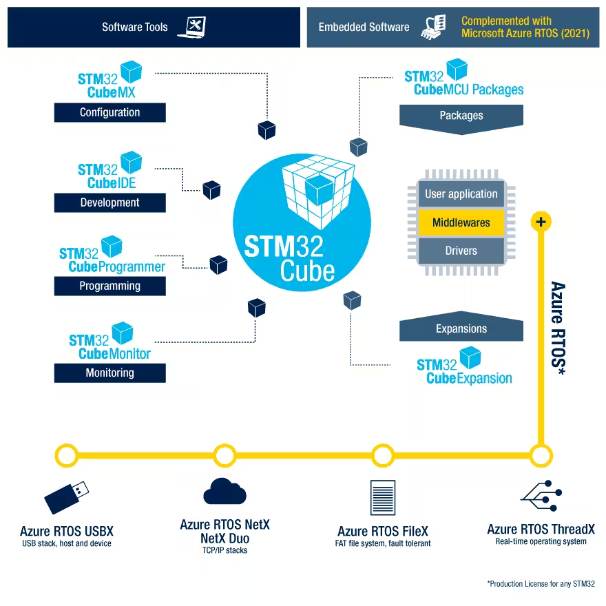

# STM32 CUBE 软件生态

## 概述

STM32 CUBE 软件生态是一系列软件工具、嵌入式软件库和各种在线资源，用于 STM32 微控制器。关键软件组件包括：**STM32CubeMX**、**STM32CubeIDE**、**STM32CubeProgrammer**、**STM32CubeMonitor**。

!!! tip
    目前，最流行的解决方案是使用 CubeMX + Keil MDK，因为 CubeIDE 不如 Keil MDK 成熟。 (2024年2月)

## STM32CubeMX - 配置

-   :material-book:{ .lg .middle } __STM32CubeMX 🎯🏆__

    ---

    STM32CubeMX 是一款图形化工具，可通过逐步过程非常轻松地配置 STM32 微控制器和微处理器，以及为 Arm® Cortex®-M 内核生成相应的初始化 C 代码或为 Arm® Cortex®-A 内核生成部分 Linux® 设备树。

    [:octicons-arrow-right-24: <a href="https://www.st.com/content/st_com/zh/stm32cubemx.html" target="_blank"> 传送门 </a>](#)

-   :material-file:{ .lg .middle } __STM32CubeMX 专题🎯🏆__

    ---

    [:octicons-arrow-right-24: <a href="https://www.zhihu.com/column/STM32CubeMX" target="_blank"> 传送门 </a>](#)

## STM32CubeIDE - 配置、开发、调试

-   :material-book:{ .lg .middle } __STM32CubeIDE 🎯🏆__

    ---

    STM32CubeIDE 是一款高级 C/C++ 开发平台，具有外设配置、代码生成、代码编译和调试功能，可用于 STM32 微控制器和微处理器。

    [:octicons-arrow-right-24: <a href="https://www.st.com/content/st_com/zh/stm32cubeide.html" target="_blank"> 传送门 </a>](#)

-   :material-file:{ .lg .middle } __STM32CubeIDE介绍、下载、安装和使用教程🎯🏆__

    ---

    [:octicons-arrow-right-24: <a href="https://zhuanlan.zhihu.com/p/468820173" target="_blank"> 传送门 </a>](#)

## STM32CubeProgrammer - 编程

-   :material-book:{ .lg .middle } __STM32CubeProgrammer 🎯🏆__

    ---

    STM32CubeProgrammer (STM32CubeProg) 是一款用于编程 STM32 产品的多操作系统软件工具。

    用以取代 STVP，它是一款用于编程 STM32 微控制器的新工具。    

    [:octicons-arrow-right-24: <a href="https://www.st.com/content/st_com/zh/stm32cubeprog.html" target="_blank"> 传送门 </a>](#)

-   :material-file:{ .lg .middle } __STM32CubeProg介绍、下载、安装和使用教程🎯🏆__

    ---

    [:octicons-arrow-right-24: <a href="https://zhuanlan.zhihu.com/p/448402624" target="_blank"> 传送门 </a>](#)

## STM32CubeMonitor - 监控

-   :material-book:{ .lg .middle } __STM32CubeMonitor 🎯🏆__

    ---

    STM32CubeMonitor 是一款图形化工具，可让用户实时监视和调整基于 STM32 微控制器和微处理器的应用程序。

    用以取代 STM Studio，STM32CubeMonitor 是一款新的用于监视 STM32 微控制器的工具。

    [:octicons-arrow-right-24: <a href="https://www.st.com/content/st_com/zh/stm32cubemonitor.html" target="_blank"> 传送门 </a>](#)

-   :material-file:{ .lg .middle } __STM32CubeMonitor介绍、下载、安装和使用教程🎯🏆__

    ---

    [:octicons-arrow-right-24: <a href="https://www.zhihu.com/column/c_1456607281147891712" target="_blank"> 传送门 </a>](#)

## 资源

-   :material-book:{ .lg .middle } __STM32 MCU 文档 🎯🏆__

    ---

    [:octicons-arrow-right-24: <a href="https://www.st.com/content/st_com/zh/stm32-mcu-developer-zone/developer-resources.html" target="_blank"> 传送门 </a>](#)

-   :material-book:{ .lg .middle } __STM32 MPU 文档 🎯🏆__

    ---

    [:octicons-arrow-right-24: <a href="https://www.st.com/content/st_com/zh/stm32-mpu-developer-zone/developer-resources.html" target="_blank"> 传送门 </a>](#)

