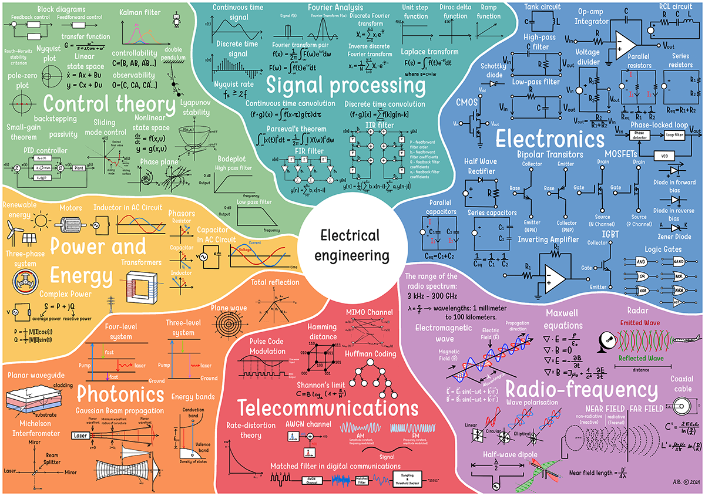

# 电路

{ : style="height:450px;width:800px" }

-  :material-web:{ .lg .middle } __EE16A&B：设计信息设备和系统 I&II🎯🏆__

    ---

    作者: Ruzena Bajcsy, Michel Maharbiz, Borivoje Nikolic, Vladimir Stojanovic

    [:octicons-arrow-right-24: <a href="https://inst.eecs.berkeley.edu/~ee16a/fa20/" target="_blank"> 传送门 </a>](#)

-  :material-book:{ .lg .middle } __初学者电子学：电路图、电路与微控制器实用介绍 🎯✅🏆__

    ---

    作者: Jonathan Bartlett

    [:octicons-arrow-right-24: <a href="https://learning.oreilly.com/library/view/electronics-for-beginners/9781484259795/" target="_blank"> 传送门 </a>](#)

