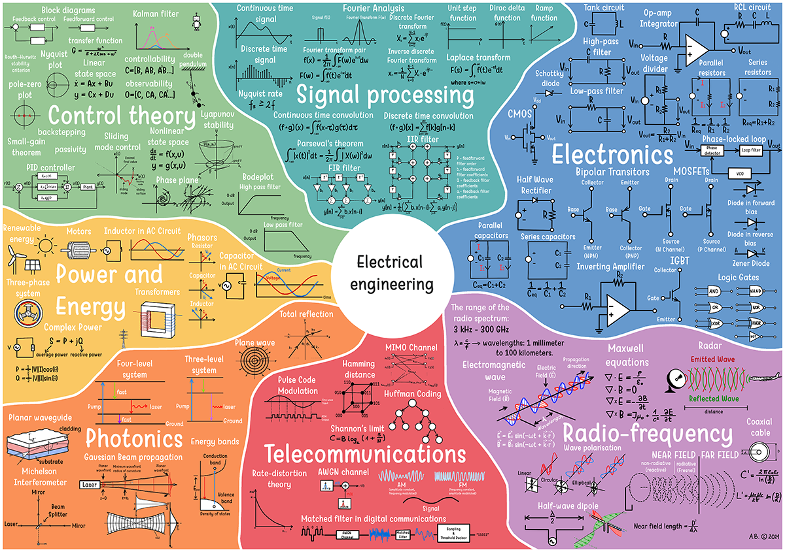

# 嵌入式系统

{ : style="height:400px;width:800px" }

## 理论

### 电子电路

{ : style="height:450px;width:800px" }

-  :material-book:{ .lg .middle } __初学者电子学：电路图、电路与微控制器实用介绍 🎯✅🏆__

    ---

    作者: Jonathan Bartlett

    [:octicons-arrow-right-24: <a href="https://learning.oreilly.com/library/view/electronics-for-beginners/9781484259795/" target="_blank"> 传送门 </a>](#)

## 仿真

-   :fontawesome-brands-square-github:{ .lg .middle } __Renode__

    ---

    硬件仿真框架

    [:octicons-arrow-right-24: <a href="https://teachyourselfcs.com/" target="_blank"> 传送门 </a>](#)

-   :fontawesome-brands-square-github:{ .lg .middle } __Wokwi__

    ---

    硬件仿真框架。Web / VSCode 插件

    [:octicons-arrow-right-24: <a href="https://wokwi.com/" target="_blank"> 传送门 </a>](#)

## 开发套件

### Arduino

-  :simple-arduino:{ .lg .middle } __Arduino官网__

    ---

    [:octicons-arrow-right-24: <a href="https://www.arduino.cc/" target="_blank"> 传送门 </a>](#)

-  :material-book:{ .lg .middle } __Arduino食用指南，第三版__

    ---

    作者: Michael Margolis, Brian Jepson, Nicholas Robert Weldin

    [:octicons-arrow-right-24: <a href="https://learning.oreilly.com/library/view/arduino-cookbook-3rd/9781491903513/" target="_blank"> 传送门 </a>](#)

### STM32

-   :simple-stmicroelectronics:{ .lg .middle } __STM32官网__

    ---

    [:octicons-arrow-right-24: <a href="https://www.st.com/zh/microcontrollers-microprocessors/stm32-32-bit-arm-cortex-mcus.html" target="_blank"> 传送门 </a>](#)

### ESP32

-   :simple-espressif:{ .lg .middle } __ESP32官网__

    ---

    [:octicons-arrow-right-24: <a href="https://www.espressif.com/zh-hans/products/socs/esp32" target="_blank"> 传送门 </a>](#)

### Raspberry Pi

-  :material-raspberry-pi:{ .lg .middle } __Raspberry Pi官网__

    ---

    [:octicons-arrow-right-24: <a href="https://www.raspberrypi.org/" target="_blank"> 传送门 </a>](#)

-  :material-book:{ .lg .middle } __Raspberry Pi食用指南，第四版__
  
    ---

    作者: Simon Monk

    [:octicons-arrow-right-24: <a href="https://learning.oreilly.com/library/view/raspberry-pi-cookbook/9781098130916/" target="_blank"> 传送门 </a>](#)

## 集成开发环境

-  :material-microsoft-visual-studio-code:{ .lg .middle } __Visual Studio Code 🎯✅🏆__

    ---

    [:octicons-arrow-right-24: <a href="https://code.visualstudio.com/" target="_blank"> 传送门 </a>](#)

-  :material-file-code:{ .lg .middle } __Ecilpse IDE__

    ---

    [:octicons-arrow-right-24: <a href="https://www.eclipse.org/downloads/" target="_blank"> 传送门 </a>](#)

-  :simple-arduino:{ .lg .middle } __Arduino IDE ✅__

    ---

    [:octicons-arrow-right-24: <a href="https://www.arduino.cc/en/software" target="_blank"> 传送门 </a>](#)

-  :simple-platformio:{ .lg .middle } __PlatformIO IDE 🎯🏆__

    ---

    [:octicons-arrow-right-24: <a href="https://platformio.org/platformio-ide" target="_blank"> 传送门 </a>](#)

-  :simple-armkeil:{ .lg .middle } __Arm Keil MDK 🎯🏆__

    ---

    [:octicons-arrow-right-24: <a href="https://www.keil.com/demo/eval/arm.htm" target="_blank"> 传送门 </a>](#)

-  :simple-stmicroelectronics:{ .lg .middle } __STM32CubeIDE 🎯🏆__

    ---

    [:octicons-arrow-right-24: <a href="https://www.st.com/en/development-tools/stm32cubeide.html" target="_blank"> 传送门 </a>](#)

## 常用链接

-  :material-file-code:{ .lg .middle } __正点原子 🎯🏆__

    ---

    [:octicons-arrow-right-24: <a href="http://www.alientek.com/" target="_blank"> 官网 </a>](#)

    [:octicons-arrow-right-24: <a href="http://www.openedv.com/docs/" target="_blank"> 文档 </a>](#)

