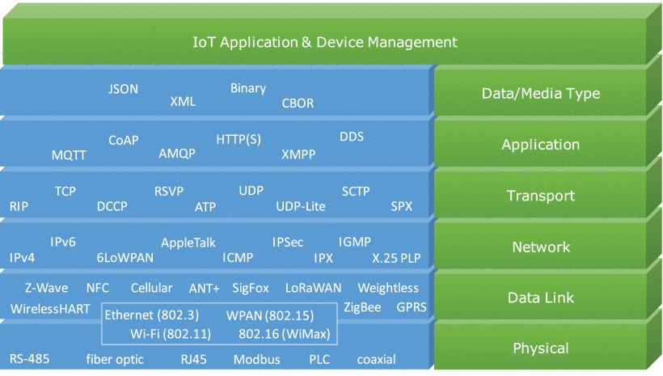
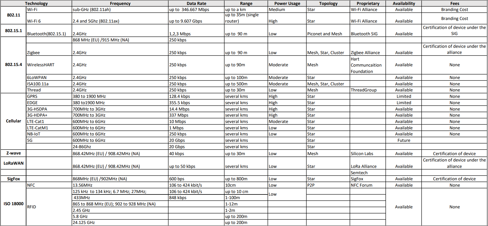

# 物联网

{: style="height:400px;width:800px" }

## 介绍

-  :material-book:{ .lg .middle } __物联网和边缘计算架构师指南 - 第二版🎯✅🏆__

    ---

    作者: Perry Lea

    [:octicons-arrow-right-24: <a href="https://learning.oreilly.com/library/view/iot-and-edge/9781839214806/" target="_blank"> 传送门 </a>](#)

## 硬件

参考 __嵌入式系统__ 部分。

## 软件

待更新。

## 协议

### 开放系统互联 (OSI) 模型

[原文@sheldon](https://community.fs.com/article/tcpip-vs-osi-whats-the-difference-between-the-two-models.html)

!!! info
    OSI 模型是一个概念模型，用于描述和规范网络通信中涉及的不同软件和硬件组件应如何分工和相互交互。它有七层。

#### 第七层：应用层

OSI 模型的应用层直接与软件应用程序交互，根据需要提供通信功能，它是最接近最终用户的层。应用层的功能通常包括验证通信伙伴和资源的可用性以支持任何数据传输。该层还为最终应用程序定义协议，例如域名系统 (DNS)、文件传输协议 (FTP)、超文本传输协议 (HTTP)、Internet 消息访问协议 (IMAP)、邮局协议 (POP)、简单邮件传输协议 (SMTP)、简单网络管理协议 (SNMP) 和 Telnet (终端仿真)。

#### 第六层：表示层

表示层检查数据以确保其与通信资源兼容。它将数据转换为应用级和较低级别接受的形式。任何所需的数据格式化或代码转换也由第六层处理，例如将扩展二进制编码十进制交换码 (EBCDIC) 编码的文本文件转换为美国信息交换标准代码 (ASCII) 编码的文本文件。它还用于数据压缩和加密。例如，视频通话在传输过程中将被压缩，以便可以更快地传输，数据将在接收端恢复。对于具有高安全性要求的数据，例如包含密码的文本消息，它将在此层加密。

#### 第五层：会话层

会话层控制计算机之间的对话 (连接)。它建立、管理、维护和最终终止本地和远程应用程序之间的连接。第 5 层软件还处理身份验证和授权功能。它还验证数据是否已传送。会话层通常在使用远程过程调用的应用程序环境中显式实现。

#### 第四层：传输层

传输层提供数据序列从源主机通过一个或多个网络传输到目标主机的功能和手段，同时保持服务质量 (QoS) 功能并确保数据的完整传递。通过纠错和类似功能可以保证数据的完整性。它还可以提供显式流量控制功能。虽然不严格符合 OSI 模型，但 TCP 和用户数据报协议 (UDP) 是第 4 层中的基本协议。

#### 第三层：网络层

网络层通过逻辑寻址和交换功能处理数据包路由。网络是一个可以连接许多节点的媒体。每个节点都有一个地址。当一个节点需要将消息传输到其他节点时，它只能提供消息的内容和目标节点的地址，然后网络将找到传递消息到目标节点的方法，可能通过其他节点路由。如果消息太长，网络可能会在一个节点将其分成几个段，分别发送并在另一个节点重新组装片段。

#### 第二层：数据链路层

数据链路层提供节点到节点的传输，即两个直接连接的节点之间的连接。它处理帧中数据的打包和解包。它定义了建立和终止两个物理连接设备之间连接的协议，例如点对点协议 (PPP)。数据链路层通常分为两个子层——媒体访问控制 (MAC) 层和逻辑链路控制 (LLC) 层。MAC 层负责控制网络中的设备如何访问媒体和获得传输数据的权限。LLC 层负责识别和封装网络层协议，并控制错误检查和帧同步。

#### 第一层：物理层

物理层定义了数据连接的电气和物理规范。例如，连接器的引脚布局、电缆的操作电压、光纤电缆规范和无线设备的频率。它负责在物理介质中传输和接收非结构化原始数据。比特率控制是在物理层完成的。它是低级网络设备的层，从不涉及协议或其他更高层项。

### TCP/IP 模型

!!! info
    TCP/IP模型也是一个分层参考模型，但它是一个四层模型。它的另一个名字是互联网协议套件。它通常被称为TCP/IP，因为基本协议是TCP和IP，但在这个模型中不仅使用这两个协议。

#### 应用层

TCP/IP模型的应用层为应用程序提供了访问其他层服务的能力，并定义了应用程序用于交换数据的协议。最广为人知的应用层协议包括HTTP、FTP、SMTP、Telnet、DNS、SNMP和路由信息协议(RIP)。

#### 传输层

传输层，也称为主机到主机传输层，负责向应用层提供会话和数据报通信服务。这一层的核心协议是TCP和UDP。TCP提供一对一的、面向连接的、可靠的通信服务。它负责对发送的数据包进行排序和确认，并恢复传输中丢失的数据包。UDP提供一对一或一对多、无连接、不可靠的通信服务。UDP通常用于传输的数据量很小(例如数据可以装入单个数据包)。

#### 网际层

因特网层负责主机寻址、封装和路由功能。Internet协议层的核心协议有IP、地址解析协议(ARP)、Internet控制消息协议(ICMP)和Internet组管理协议(IGMP)。IP是一种可路由协议，负责IP寻址、路由、分组和重组。ARP负责发现网络访问层地址，例如与给定的Internet层访问相关联的硬件地址。ICMP负责提供诊断功能，并报告由于IP报文发送失败而导致的错误。IGMP负责IP组播组的管理。在这一层中，IP为数据包添加报头，称为IP地址。现在有IPv4(32位)地址和IP Ipv6(128位)地址。

#### 数据链路层

网络访问层(或链路层)负责将TCP/IP数据包放在网络介质上，并从网络介质上接收TCP/IP数据包。TCP/IP被设计成独立于网络访问方法、帧格式和介质。换句话说，它独立于任何特定的网络技术。这样，TCP/IP就可以用来连接不同的网络类型，如以太网、令牌环、X.25、帧中继和异步传输模式(ATM)。

### 协议栈

-  :material-file:{ .lg .middle } __通讯协议大全__

    ---

    作者: 大师兄的小杂铺

    [:octicons-arrow-right-24: <a href="https://blog.csdn.net/qq_39543984/article/details/122292628" target="_blank"> 传送门 </a>](#)

[🔗 图源](https://ieeexplore.ieee.org/mediastore_new/IEEE/content/media/6287639/8948470/9090208/almas1-2993363-large.gif)

这里我们以OSI模型层次来划分协议。

#### 第五层：会话层 & 第六层：表示层 & 第七层：应用层

##### REST/HTTP

##### MQTT

##### CoAP

##### AMQP

##### DDS

##### XMPP

##### Modbus

#### 第三层：网络层 & 第四层：传输层

##### TCP

##### UDP

##### IPv4

##### IPv6

##### 6LoWPAN

#### 第一层：物理层 & 第二层：数据链路层

##### Bluetooth 📶

##### Thread 📶

##### WiFi(IEEE 802.11) 📶

##### Zigbee 📶

##### Z-Wave 📶

##### LoRa 📶

##### NB-IoT 📶

##### LTE-M 📶

##### Sigfox 📶

##### NFC 📶

##### RFID 📶

##### Ethernet🔌

##### USB🔌

### IoT 协议比较

-  :material-file:{ .lg .middle } __6种无线通信技术对比（WiFi，Zigbee，蓝牙，Lora，NB-lot，4G）。__

    ---

    作者: 点灯大师

    [:octicons-arrow-right-24: <a href="https://zhuanlan.zhihu.com/p/614305240" target="_blank"> 传送门 </a>](#)

## 框架

Home Assistant

ThingsBoard