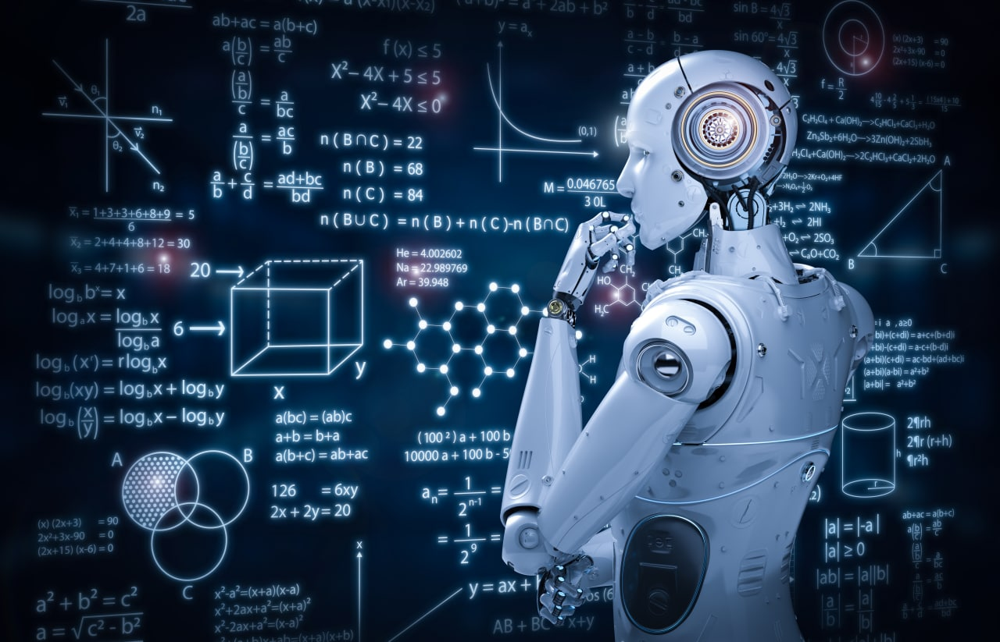

<!-- ---
comments: false
--- -->

# 数学

{ width=100% }

!!! tip "提示"
    你永远无法学到所有的东西，只在需要学的时候学需要的东西。

## 通用

-   :fontawesome-brands-youtube:{ .lg .middle } __3Blue1Brown__

    ---

    一个关于数学和编程的 YouTube 频道。

    [:octicons-arrow-right-24: <a href="https://www.youtube.com/@3blue1brown" target="_blank"> 传送门 </a>](#)  

-   :material-book:{ .lg .middle } __编程不难 🎯✅🏆__

    ---

    中文，机器学习可视化系列 1

    阅读进度：[36/36]

    代码实践：[15/36]

    [:octicons-arrow-right-24: <a href="https://github.com/Visualize-ML/Book1_Python-For-Beginners" target="_blank"> 传送门 </a>](#)

-  :material-book:{ .lg .middle } __可视之美 🎯✅🏆__

    ---

    中文，机器学习可视化系列 2

    阅读进度：[36/36]

    代码实践：[0/36]

    [:octicons-arrow-right-24: <a href="https://github.com/Visualize-ML/Book2_Beauty-of-Data-Visualization" target="_blank"> 传送门 </a>](#)

-  :material-book:{ .lg .middle } __数学元素__

    ---

    中文，机器学习可视化系列 3

    [:octicons-arrow-right-24: <a href="https://github.com/Visualize-ML/Book3_Elements-of-Mathematics" target="_blank"> 传送门 </a>](#)

