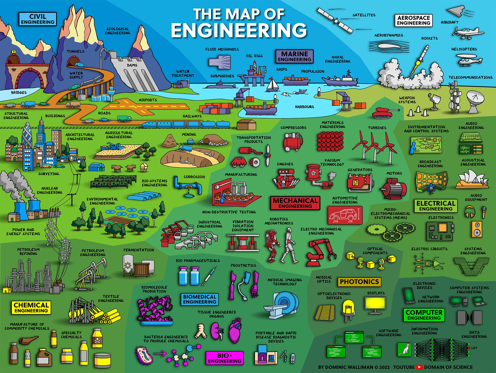

<!-- ---
comments: flase
--- -->

# 🔭 Stay Hungry, Stay Foolish

!!! quote
    I have places to go, things to do, and people to impress.

## 🎙️ Foreword
Welcome to my personal tech blog! This website serves as a roadmap for my personal study, research and development. Explore this site by clicking the navigation bar on the top or the left.

!!! info
    🎯 mark means I am currently actively learning related knowledge. The marked topics will be dynamically modified.

## 🔗 Useful Links

<!-- to search icons, go to https://squidfunk.github.io/mkdocs-material/reference/icons-emojis/ -->

-   :fontawesome-solid-house:{ .lg .middle } __Personal Website__

    ---

    Shuaiwen Cui's personal website

    [:octicons-arrow-right-24: <a href="http://www.cuishuaiwen.com" target="_blank"> Portal </a>](#)

-   :fontawesome-brands-linkedin:{ .lg .middle } __Linkedin Profile__

    ---

    Shuaiwen Cui's LinkedIn profile

    [:octicons-arrow-right-24: <a href="https://www.linkedin.com/in/shaun-shuaiwen-cui/" target="_blank"> Portal </a>](#)

-   :fontawesome-brands-github:{ .lg .middle } __Github__

    ---

    Shuaiwen Cui's GitHub profile, hope you can star this repo if you like it

    [:octicons-arrow-right-24: <a href="https://github.com/Shuaiwen-Cui" target="_blank"> Portal </a>](#)

-   :fontawesome-brands-researchgate:{ .lg .middle } __Researchgate__

    ---

    Shuaiwen Cui's ResearchGate profile

    [:octicons-arrow-right-24: <a href="https://www.researchgate.net/profile/Shuaiwen-Cui" target="_blank"> Portal </a>](#)

-   :fontawesome-brands-youtube:{ .lg .middle } __Youtube__

    ---

    Shuaiwen Cui's Youtube channel

    [:octicons-arrow-right-24: <a href="https://www.youtube.com/channel/UCGNpQ1avIeJVN2tQ2U0zHog" target="_blank"> Portal </a>](#)

-   :fontawesome-brands-bilibili:{ .lg .middle } __BiliBili__

    ---

    Shuaiwen Cui's Bilibili Channel

    [:octicons-arrow-right-24: <a href="https://space.bilibili.com/422612631" target="_blank"> Portal </a>](#)

-   :simple-roadmapdotsh:{ .lg .middle } __Roadmap__

    ---

    Roadmap for everything to become a developer

    [:octicons-arrow-right-24: <a href="https://roadmap.sh/" target="_blank"> Portal </a>](#)

## 🌐 Online Study Platforms

-  :simple-coursera:{ .lg .middle } __Coursera 🏆__

    ---

    Coursera is a very good online study platform. It provides a lot of courses for free. You can also pay for the certificate.

    [:octicons-arrow-right-24: <a href="https://www.coursera.org/" target="_blank"> Portal </a>](#)

- :simple-edx:{ .lg .middle } __edX__

    ---

    edX is another very good online study platform. It provides a lot of courses for free. You can also pay for the certificate.

    [:octicons-arrow-right-24: <a href="https://www.edx.org/" target="_blank"> Portal </a>](#)

- :simple-udemy:{ .lg .middle } __Udemy__

    ---

    Udemy is another very good online study platform. It provides a lot of courses for free. You can also pay for the certificate.

    [:octicons-arrow-right-24: <a href="https://www.udemy.com/" target="_blank"> Portal </a>](#)

- :material-book:{ .lg .middle } __O'Reilly__

    ---

    O'Reilly online library.

    [:octicons-arrow-right-24: <a href="https://learning.oreilly.com/playlists/" target="_blank"> Portal </a>](#)

## 🏆 Featured Posts

-   :fontawesome-solid-server:{ .lg .middle } __Have A Server__

    ---

    How to get a cloud server.

    [:octicons-arrow-right-24: <a href="http://www.cuishuaiwen.com:8000/CLOUD/HANDS-ON/001-HAVE-A-SERVER/have-a-server/" target="_blank"> Portal </a>](#)

-   :material-post:{ .lg .middle } __Tech Blog__

    ---

    How to have a cool tech blog using MkDocs and Material for MkDocs.

    [:octicons-arrow-right-24: <a href="http://www.cuishuaiwen.com:8000/PROJECT/TECH-BLOG/mkdocs_and_material/" target="_blank"> Portal </a>](#)

## 🗺 Map of Engineering

[@Dominic Walliman](https://twitter.com/DominicWalliman/status/1522525405391036427)

